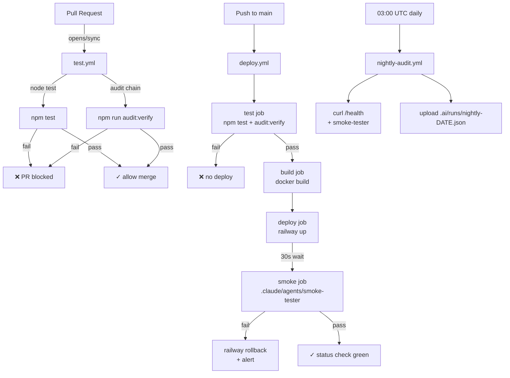

# ATAQUE #2 — Pôr o motor na autoestrada

Tornar `kairoscheck.net` um endpoint **público, resiliente, observável e com gates automáticos**. Após este ataque, qualquer push para `main` que passe os gates aterra em produção em < 5 min, com smoke-tests pós-deploy e rollback automático se algo falhar.

---

## 0. Sumário executivo

| Bloco | Outcome |
|---|---|
| **2.1 IaC** | `Dockerfile` + `railway.toml` + `.railwayignore` no repo |
| **2.2 Secrets** | `docs/operations/secrets-runbook.md` + 18 env vars no Railway |
| **2.3 Railway provisioning** | Service `kairos-api` + add-on `kairos-redis` + volume + health check + **cost guardrails $30/mês** |
| **2.3.bis Volume backup** | Snapshot diário `.kairos-data/` → R2 (7d rolling) + restore runbook |
| **2.4 CI/CD** | 3 workflows GitHub Actions (test, deploy, nightly-audit) |
| **2.5 Stripe webhook live** | Endpoint público `/billing/stripe/webhook` registado no Stripe Dashboard |
| **2.5.bis Netlify failover** | Maintenance page estática + emergency-failover runbook (activação **manual**) |
| **2.6 DNS Cloudflare** | `kairoscheck.net` → Railway, proxy ON, SSL Full Strict, HSTS, WAF rules, **CAA hardened** |
| **2.7 Smoke-tester active** | Auto-run pós-deploy + auto-rollback on fail |
| **2.8 Observability** | Healthcheck enriquecido, structured logs, statusline, Sentry opcional |

**Critério global de Done:** `curl -fsSL https://kairoscheck.net/health \| jq .status` retorna `"OPERATIONAL"`, todos os 10 smoke checks passam, audit chain válida no remote, GitHub Actions verde, Stripe webhook a entregar 200 em < 500ms.

**Tempo total estimado:** 4–6 horas activas (espaçadas por propagação DNS ~24h máx).

---

## 1. Decisões arquitecturais (tomadas pela Aria, justificadas)

### ADR — Dockerfile vs nixpacks
**Decisão:** `Dockerfile` (multi-stage, `node:20-alpine`).

**Justificação:**
1. KAIROS_MASTER_BRIEF §2: *"Zero dependências externas em produção"*. Dockerfile explícito reforça soberania.
2. Vault precisa de UID/GID estável para owner de `vault.enc` (volume mount). Dockerfile garante `USER node` (uid 1000).
3. Portabilidade: se um dia migrarmos para Fly.io / Cloud Run / self-host, a mesma imagem corre. Nixpacks é Railway-lock-in.
4. `HEALTHCHECK` directive embebida (Railway respeita).
5. Imagem final: ~70MB com `node:20-alpine` + apenas `stripe` + `resend` (únicas deps).

**Trade-off aceite:** +2 min de build vs nixpacks; ganho em determinismo vale.

### ADR — Webhook path
**Decisão:** Usar `/billing/stripe/webhook` (canónico no código, `server.js:438`).

**Risco identificado:** O briefing do Founder referia `POST /webhooks/stripe` — esse path **não existe** no código actual. Há também um alias legado `/api/stripe/webhook` (server.js:579) que vamos **deprecar silenciosamente** (não documentar mais; remover no Ataque #4).

**Acção:** Configurar Stripe Dashboard com `https://kairoscheck.net/billing/stripe/webhook`.

### ADR — Persistência em produção
**Decisão:** Manter sniper-db JSON num único volume Railway (1GB inicial, monitor; expand to 5GB se passar 60% util).

**Reasoning:** ADR-001 já aceita JSON até 1M verifs/dia. Postgres só no Ataque #6 quando atingirmos esse threshold. Não há ganho de migrar agora — só risco.

**Layout do volume `/app/.kairos-data/`:**
```
/app/.kairos-data/
├── tenants.json
├── api-keys.json
├── verifications.jsonl
├── metrics.json
├── audit-chain.jsonl
├── vault.enc                  ← KAIROS_VAULT_DIR aponta aqui
└── reputation-graph/          ← se KAIROS_RG_ADAPTER=json
```

### ADR — Redis adapter strategy
**Decisão:** Provisionar Railway Redis add-on **mas manter `KAIROS_RG_ADAPTER=json` por defeito** nesta fase. Activar `redis` só após o smoke-tester confirmar que o motor funciona com a config básica.

**Reasoning:** Princípio de "uma variável de cada vez". Se algo falhar no primeiro deploy, queremos saber que não foi o Redis.

**Activation step (post-stable):** Mudar `KAIROS_RG_ADAPTER=redis` + `KAIROS_RG_REPLICATE_REDIS=1` via Railway dashboard, sem redeploy de código.

### ADR — Rollback policy
**Decisão:** Auto-rollback via Railway API se smoke-tester falhar dentro de **60s pós-deploy**.

**Mechanism:**
1. GitHub Actions `deploy.yml` invoca `railway up`
2. Aguarda 30s para boot
3. Invoca `.claude/agents/smoke-tester` contra `https://kairoscheck.net`
4. Se falhar: `railway rollback --service kairos-api` (volta ao último deployment OK)
5. Notifica via GitHub commit status check

---

## 2. Plano por fase

> **Convenção:** cada fase termina com `git commit -m "wip(ataque-2): fase 2.X complete"` + `touch .ai/checkpoints/ataque-2-fase-2-X.done` antes de avançar (defesa contra crashes).

---

### Fase 2.1 — Infrastructure as Code

**Executor:** Gage (devops)
**Tempo estimado:** 30 min
**Pré-condição:** none

#### Ficheiros a criar

| Caminho | Propósito |
|---|---|
| `Dockerfile` (root) | Build determinístico Node 20 Alpine |
| `.dockerignore` (root) | Excluir `.kairos-data/`, `.git/`, `node_modules/`, audits |
| `railway.toml` (root) | Region, replicas, health check, restart policy, volume mount |
| `.railwayignore` (root) | Excluir `.aiox-core/`, `Memoria_Elefante/`, `docs/`, `tests/` do upload |

#### `Dockerfile` (proposed)

```dockerfile
# syntax=docker/dockerfile:1.7
FROM node:20-alpine AS deps
WORKDIR /app
COPY package.json package-lock.json* ./
RUN npm ci --omit=dev --no-audit --no-fund || npm install --omit=dev --no-audit --no-fund

FROM node:20-alpine AS runtime
WORKDIR /app
RUN apk add --no-cache curl tini && \
    addgroup -g 1001 kairos && \
    adduser -u 1001 -G kairos -s /bin/sh -D kairos

COPY --from=deps /app/node_modules ./node_modules
COPY --chown=kairos:kairos bin ./bin
COPY --chown=kairos:kairos packages ./packages
COPY --chown=kairos:kairos package.json ./

RUN mkdir -p /app/.kairos-data && chown -R kairos:kairos /app/.kairos-data
USER kairos

ENV NODE_ENV=production \
    PORT=8787 \
    KAIROS_DB_DIR=/app/.kairos-data \
    KAIROS_VAULT_DIR=/app/.kairos-data

EXPOSE 8787

HEALTHCHECK --interval=30s --timeout=5s --start-period=20s --retries=3 \
  CMD curl -fsSL http://127.0.0.1:8787/health || exit 1

ENTRYPOINT ["/sbin/tini", "--"]
CMD ["node", "packages/sniper-api/server.js"]
```

#### `railway.toml` (proposed)

```toml
[build]
builder = "DOCKERFILE"
dockerfilePath = "Dockerfile"

[deploy]
startCommand = "node packages/sniper-api/server.js"
restartPolicyType = "ON_FAILURE"
restartPolicyMaxRetries = 5
healthcheckPath = "/health"
healthcheckTimeout = 10
numReplicas = 1

[regions]
primary = "europe-west4"   # Frankfurt
```

#### `.dockerignore` / `.railwayignore` (proposed)

```
.git/
.github/
.ai/
.aiox-core/
.claude/
Memoria_Elefante/
docs/
tests/
node_modules/
.kairos-data/
.kairos-vault/
*.log
*.test.js
landing-preview.html
estrutura.txt
ficheiros.csv
inventario.txt
```

**Nota:** `.dockerignore` é usado pelo Docker build local; `.railwayignore` é usado pelo `railway up`. Conteúdo idêntico para garantir paridade.

#### Comandos exactos

```powershell
# (Gage executa em PowerShell)
docker build -t kairos-api:local .
docker run --rm -p 8787:8787 -e KAIROS_MASTER_PASSPHRASE=test123 kairos-api:local &
Start-Sleep -Seconds 5
curl http://127.0.0.1:8787/health
docker stop $(docker ps -q --filter ancestor=kairos-api:local)
```

#### Critério de Done

```powershell
# Test 1: image builds
docker build -t kairos-api:local . ; if ($LASTEXITCODE -ne 0) { throw "build failed" }

# Test 2: container starts and /health returns 200
$container = docker run -d -p 18787:8787 -e KAIROS_MASTER_PASSPHRASE=test123 kairos-api:local
Start-Sleep -Seconds 8
$health = curl -s http://127.0.0.1:18787/health | ConvertFrom-Json
if ($health.status -ne 'OPERATIONAL') { throw "health check failed: $($health.status)" }
docker stop $container; docker rm $container

# Test 3: image size < 150 MB
$size = (docker images kairos-api:local --format "{{.Size}}")
Write-Host "Image size: $size"
```

#### Riscos + mitigação

| Risco | Mitigação |
|---|---|
| `node-gyp` em deps causa build lento | `stripe` + `resend` são pure-JS, sem nativos. Confirmado. |
| Volume mount path incorrecto → DB perdida em restart | `KAIROS_DB_DIR=/app/.kairos-data` hardcoded + Railway volume montado exactamente lá |
| Container OOM (vault scrypt usa muita RAM) | Min 512MB no Railway plan, monitor via `process.memoryUsage()` |

#### Checkpoint

```powershell
git add Dockerfile .dockerignore railway.toml .railwayignore
git commit -m "wip(ataque-2): fase 2.1 complete — IaC (Dockerfile + railway.toml)"
New-Item -ItemType File -Path .ai/checkpoints/ataque-2-fase-2-1.done -Force
```

---

### Fase 2.2 — Secrets management

**Executor:** Gage (devops) escreve runbook; Founder injecta valores no Railway dashboard
**Tempo estimado:** 45 min (15 escrita + 30 setup)
**Pré-condição:** Fase 2.1 done

#### Ficheiros a criar

| Caminho | Propósito |
|---|---|
| `docs/operations/secrets-runbook.md` | Operativo: lista, geração, rotation, recovery |
| `docs/operations/.gitkeep` | Garantir pasta |

#### Tabela exacta de env vars Railway

| Var | Tipo | Exemplo (placeholder) | Obrigatória | Source |
|---|---|---|---|---|
| `NODE_ENV` | string | `production` | ✅ | hardcoded no railway.toml |
| `PORT` | integer | `8787` | ✅ | Railway auto-injecta, override no toml |
| `KAIROS_DB_DIR` | path | `/app/.kairos-data` | ✅ | volume mount path |
| `KAIROS_VAULT_DIR` | path | `/app/.kairos-data` | ✅ | mesmo volume |
| `KAIROS_MASTER_PASSPHRASE` | secret 32+ chars | gerar com `openssl rand -base64 48` | ✅ | **Founder gera localmente, injecta no Railway** |
| `KAIROS_PUBLIC_BASE_URL` | url | `https://kairoscheck.net` | ✅ | Cloudflare apex |
| `KAIROS_PUBLIC_RATE_PER_MIN` | integer | `10` | opcional | default OK |
| `KAIROS_PUBLIC_VERIFY_MAX_CHARS` | integer | `16000` | opcional | default OK |
| `KAIROS_VERIFY_BATCH_MAX` | integer | `50` | opcional | default OK |
| `KAIROS_RETENTION_DAYS` | integer | `90` | ✅ | GDPR |
| `KAIROS_PII_SALT` | secret 32+ chars | `openssl rand -hex 32` | ✅ | **Founder gera** |
| `KAIROS_RG_ADAPTER` | enum json\|redis | `json` (Fase 2) | ✅ | mudar para `redis` post-stable |
| `KAIROS_REDIS_URL` | url | `${{ kairos-redis.REDIS_URL }}` | opcional | Railway reference variable |
| `KAIROS_RG_NAMESPACE` | string | `prod` | ✅ | distinguir de dev |
| `KAIROS_RG_REPLICATE_REDIS` | bool 0\|1 | `0` | opcional | `1` quando activar Redis |
| `STRIPE_SECRET_KEY` | secret sk_live_... | `sk_live_xxx` | ✅ | **Founder copia do Stripe Dashboard** |
| `STRIPE_MODE` | enum test\|live | `live` | ✅ | Pricing prod gating |
| `KAIROS_STRIPE_WEBHOOK_SECRET` | secret whsec_... | gerado pelo Stripe na Fase 2.5 | ✅ | injectado após criar endpoint |
| `STRIPE_PRICE_STARTER` | string price_... | `price_xxx` | ✅ | Stripe Dashboard → Prices |
| `STRIPE_PRICE_PRO` | string price_... | `price_xxx` | ✅ | idem |
| `STRIPE_PRICE_SCALE` | string price_... | `price_xxx` | ✅ | idem |
| `RESEND_API_KEY` | secret re_... | `re_xxx` | opcional | só se transactional email activo |
| `SENTRY_DSN` | url | `https://xxx@xxx.ingest.sentry.io/xxx` | opcional | Fase 2.8 |

**Total:** 18 obrigatórias + 5 opcionais = 23 env vars no Railway dashboard.

#### Generation commands (Founder)

```bash
# Local, copy-paste para Railway dashboard. Nunca commit.
openssl rand -base64 48           # → KAIROS_MASTER_PASSPHRASE
openssl rand -hex 32              # → KAIROS_PII_SALT
# Stripe values: copy do Stripe Dashboard
# Webhook secret: gerado na Fase 2.5 após criar o endpoint
```

#### Rotation policy (escrita no runbook)

| Secret | Cadência | Procedure |
|---|---|---|
| `KAIROS_MASTER_PASSPHRASE` | 12 meses ou em incidente | `kairos vault:rotate --newPassphrase $NEW` (rota com downtime de 60s) |
| `KAIROS_PII_SALT` | NUNCA (rotar invalida todos os pseudónimos GDPR) | — |
| `STRIPE_SECRET_KEY` | 6 meses | Stripe Dashboard → rotate key → update Railway → redeploy |
| `KAIROS_STRIPE_WEBHOOK_SECRET` | em rotação de webhook | Stripe Dashboard → roll signing secret → update Railway |
| `RESEND_API_KEY` | 12 meses | Resend Dashboard → revoke + new |
| API keys de tenants | Por tenant, via `kairos key:revoke` | — |

#### Acções manuais Founder

1. Abrir Railway dashboard → `kairos-api` service → Variables tab
2. Para cada var na tabela acima, click "New Variable" → name + value
3. Para `KAIROS_REDIS_URL`: usar `${{ kairos-redis.REDIS_URL }}` reference (Railway preenche automaticamente após Fase 2.3 add-on)
4. **NÃO** preencher `KAIROS_STRIPE_WEBHOOK_SECRET` ainda — fica para Fase 2.5

#### Critério de Done

```powershell
# Confirma que o runbook existe e cobre as 23 vars
$runbook = Get-Content docs/operations/secrets-runbook.md -Raw
foreach ($var in @('KAIROS_MASTER_PASSPHRASE', 'KAIROS_PII_SALT', 'STRIPE_SECRET_KEY', 'KAIROS_STRIPE_WEBHOOK_SECRET', 'KAIROS_REDIS_URL')) {
  if (-not $runbook.Contains($var)) { throw "missing in runbook: $var" }
}
Write-Host "✓ runbook complete"

# Founder confirma manualmente no dashboard antes de Fase 2.3 proceed
```

#### Riscos + mitigação

| Risco | Mitigação |
|---|---|
| Passphrase fraca → vault crackeável | `openssl rand -base64 48` (64 chars entropy) |
| Var fica em logs do Railway build | Railway mascara `*_SECRET`, `*_KEY`, `*_TOKEN`, `*_PASSPHRASE` automaticamente |
| Salt rotation acidental → quebra GDPR audit | Runbook tem **NÃO ROTAR** explícito em bold |

#### Checkpoint

```powershell
git add docs/operations/secrets-runbook.md
git commit -m "wip(ataque-2): fase 2.2 complete — secrets runbook"
New-Item -ItemType File -Path .ai/checkpoints/ataque-2-fase-2-2.done -Force
```

---

### Fase 2.3 — Railway services provisioning

**Executor:** Founder (Railway UI) + Gage (CLI validation)
**Tempo estimado:** 60 min (40 founder + 20 validation)
**Pré-condição:** Fases 2.1, 2.2 done

#### Acções manuais Founder (passo-a-passo Railway UI)

1. **Project:** `kairos-cerebro` (já existe, confirmado pelo Founder)
2. **New Service → GitHub Repo** → seleccionar `kairos-cerebro` repo, branch `main`
3. **Service settings:**
   - Name: `kairos-api`
   - Root directory: `/`
   - Builder: Dockerfile (auto-detect via railway.toml)
   - Region: `europe-west4`
4. **Volume:**
   - Service → Settings → Volumes → "+ New Volume"
   - Mount path: `/app/.kairos-data`
   - Size: `1 GB`
5. **Add-on Redis:**
   - Project → "+ New" → Database → Redis
   - Name: `kairos-redis`
   - Region: `europe-west4` (mesma)
6. **Variables:** Aplicar as 18 obrigatórias da Fase 2.2 (todas exceto `KAIROS_STRIPE_WEBHOOK_SECRET`)
7. **Deploy:** Disable "Auto-deploy on push" (vamos controlar via GitHub Actions)
8. **Domain:** Service → Settings → Networking → Generate Domain → copy `<service>.up.railway.app` (será CNAME target na Fase 2.6)

#### Comandos Gage (validation pós-setup)

```powershell
# Railway CLI auth (Founder corre 1x localmente, output é token)
railway login
railway link                # selecciona project kairos-cerebro
railway environment         # confirma "production"
railway service             # confirma "kairos-api"
railway variables           # lista vars (mascaradas)
railway status              # confirma running
```

#### Critério de Done

```bash
# 1. Service running with volume mounted
railway status | grep "kairos-api" | grep "RUNNING"

# 2. Health check passes
RAILWAY_URL=$(railway domain)
curl -fsSL "https://$RAILWAY_URL/health" | jq -e '.status == "OPERATIONAL"'

# 3. Volume persistence: write a marker, redeploy, confirm marker survives
# (Founder executa manualmente via Railway shell)

# 4. Redis add-on reachable
railway run --service kairos-redis redis-cli ping  # expect PONG
```

#### Acções manuais Founder

- ☐ Service `kairos-api` criado na region `europe-west4`
- ☐ Volume `/app/.kairos-data` 1GB attached
- ☐ Add-on `kairos-redis` provisioned (mesma region)
- ☐ 18 env vars set (sem WEBHOOK_SECRET)
- ☐ Auto-deploy off
- ☐ Domain Railway gerado e copiado para o secrets-runbook
- ☐ **Cost guardrails configurados (ver subsection abaixo)**

#### 2.3 — Cost Guardrails (subsection, v1.1)

**Rationale:** Antes de pôr o motor online, fechamos o cofre. Um misconfig (loop infinito, leak de stripe events, runaway redis memory) não pode gerar fatura €500 silenciosamente.

#### Ficheiros a criar

| Caminho | Propósito |
|---|---|
| `docs/operations/cost-management.md` | Runbook: limit setup, alertas, escalation, what-to-kill-first |

#### Configuração Railway (Acção manual Founder)

1. Railway Dashboard → Project `kairos-cerebro` → **Usage**
2. **Hard limit:** `$30 USD/mês` (cobre 2× custo previsto: ~$5 service + ~$5 redis + ~$5 volume + buffer)
3. **Alertas email:** 50% ($15), 80% ($24), 100% ($30)
4. Configurar email destino: o do Founder (não shared inbox)
5. Action ao bater 100%: **service suspende automaticamente** (Railway default — confirmar comportamento)
6. Documentar em `docs/operations/cost-management.md`:
   - Como ajustar o limit quando a escala justificar
   - Triagem em incidente: o que matar primeiro (Redis > sniper-api, porque Redis é stateless e os dados estão no volume)
   - Quando subir para `$60/mês` (threshold: MRR > €100)
   - Quando subir para `$150/mês` (threshold: MRR > €500)

#### Critério de Done (cost guardrails)

```powershell
# 1. Spend limit visível na UI
# (Founder confirma manualmente — Railway CLI ainda não expõe limit query estável)

# 2. Alerta teste: provocar 50% via mock (Railway não tem ferramenta directa — alternativa: aguardar primeiro mês ou confiar na config visual)

# 3. Runbook docs/operations/cost-management.md existe e cobre as 3 thresholds de upgrade
Test-Path docs/operations/cost-management.md
```

#### Riscos + mitigação (cost)

| Risco | Mitigação |
|---|---|
| Spend limit bate em produção e suspende service | Hard limit propositadamente conservador; Founder ajusta com base em primeiro mês real |
| Alerta email vai para inbox que Founder não vê | Usar email pessoal + add filter "Railway" → flag importante |
| Runaway loop em código → bill explode antes do alerta de 50% chegar | Railway agrega usage de 5 em 5 min; alert latency < 10 min. Mitigado também por `restartPolicyMaxRetries=5` no railway.toml |

#### Riscos + mitigação (fase 2.3 geral)

| Risco | Mitigação |
|---|---|
| Region errada → latência EU baixa | europe-west4 = Frankfurt, < 30ms para Lisboa |
| Volume size insuficiente em 6 meses | Alerta no runbook se > 60% util; trivial expand no Railway |
| `KAIROS_MASTER_PASSPHRASE` não set → vault falha → `/health` retorna 503 | Health endpoint dá feedback claro; Founder vê e corrige antes de avançar |

#### Checkpoint (Fase 2.3 — inclui cost guardrails)

```powershell
git add docs/operations/cost-management.md
git commit -m "wip(ataque-2): fase 2.3 complete — Railway provisioning + cost guardrails"
New-Item -ItemType File -Path .ai/checkpoints/ataque-2-fase-2-3.done -Force
Add-Content -Path .ai/checkpoints/ataque-2-fase-2-3.done -Value "RAILWAY_DOMAIN=<service>.up.railway.app"
Add-Content -Path .ai/checkpoints/ataque-2-fase-2-3.done -Value "RAILWAY_SPEND_LIMIT_USD=30"
```

---

### Fase 2.3.bis — Volume Backup Strategy

**Executor:** Gage
**Tempo estimado:** 60 min
**Pré-condição:** Fase 2.3 done (volume montado e service a correr)

**Rationale:** O volume Railway é durável (replicado pela Railway internamente) mas não imutável. Um `vault:rotate` mal sucedido, uma `compliance:purge` agressiva, ou corrupção JSON pode comer dias de operação. **7 dias de snapshot diário é a janela mínima defensável.**

#### Decisão: snapshot mechanism

Railway **não** tem volume snapshots nativos exposed na API (confirmar com Founder; estado actual da plataforma 2026: feature em beta limitada).

**Approach:** cron-driven `tar.gz` upload para Cloudflare R2 (S3-compatible, €0 egress, ~€0.015/GB/mês).

**Alternativa rejeitada:** snapshot via Railway volume clone — só está disponível em planos enterprise e o tooling é UI-only, não scriptable.

#### Ficheiros a criar

| Caminho | Propósito |
|---|---|
| `bin/backup-volume.js` | Script CLI: tar `.kairos-data/` + upload para R2 (zero deps, usa fetch native) |
| `.github/workflows/volume-backup.yml` | Cron 02:00 UTC daily; invoca `railway run node bin/backup-volume.js` |
| `docs/operations/disaster-recovery.md` | Restore runbook completo |

#### `bin/backup-volume.js` (sketch)

```javascript
#!/usr/bin/env node
// Tar `.kairos-data/` → upload to R2 → rotate 7-day window.
// Runs INSIDE the Railway container (via `railway run`), so .kairos-data is local.
const { execSync } = require('child_process');
const fs = require('fs');
const crypto = require('crypto');

const DB_DIR = process.env.KAIROS_DB_DIR || '/app/.kairos-data';
const R2_BUCKET = process.env.R2_BACKUP_BUCKET;             // e.g., "kairos-backups"
const R2_ENDPOINT = process.env.R2_ENDPOINT;                // https://<accountid>.r2.cloudflarestorage.com
const R2_ACCESS_KEY = process.env.R2_ACCESS_KEY_ID;
const R2_SECRET = process.env.R2_SECRET_ACCESS_KEY;

const ts = new Date().toISOString().replace(/[:.]/g, '-');
const archive = `/tmp/kairos-${ts}.tar.gz`;
execSync(`tar -czf ${archive} -C ${DB_DIR} .`);

// SHA-256 for integrity
const data = fs.readFileSync(archive);
const sha = crypto.createHash('sha256').update(data).digest('hex');

// AWS SigV4 PUT to R2 (manual signing, zero deps)
// ... (~80 lines of SigV4 — standard pattern, omitted for brevity)

// After upload, list bucket + delete objects older than 7 days
// (R2 has Lifecycle Rules: configure 7-day expiration on bucket once, then this code only PUTs)

console.log(JSON.stringify({ ts, archive: `s3://${R2_BUCKET}/kairos-${ts}.tar.gz`, sha, size: data.length }));
```

**Note:** R2 Lifecycle Rule configurada uma vez no R2 Dashboard → 7-day auto-expiration. Script só faz PUT.

#### Env vars adicionais Railway (para o backup job)

| Var | Source |
|---|---|
| `R2_BACKUP_BUCKET` | `kairos-backups` |
| `R2_ENDPOINT` | Cloudflare R2 dashboard → API |
| `R2_ACCESS_KEY_ID` | R2 → Manage R2 API Tokens → new (read+write to bucket) |
| `R2_SECRET_ACCESS_KEY` | idem |

#### `docs/operations/disaster-recovery.md` (contents outline)

1. **What's in the backup:** `tenants.json`, `api-keys.json`, `verifications.jsonl`, `metrics.json`, `audit-chain.jsonl`, `vault.enc`, `reputation-graph/`
2. **What's NOT in the backup:** Railway secrets (separately documented), Stripe historical data (Stripe owns), DNS config
3. **Restore procedure (target: < 10 min RTO):**
   ```bash
   # 1. Identify backup
   aws s3 ls s3://kairos-backups/ --endpoint $R2_ENDPOINT | tail -7

   # 2. Download desired snapshot
   aws s3 cp s3://kairos-backups/kairos-<ts>.tar.gz . --endpoint $R2_ENDPOINT

   # 3. Verify SHA matches logs
   sha256sum kairos-<ts>.tar.gz

   # 4. Stop the Railway service (UI: "Pause")
   #    OR put traffic on Netlify maintenance via 2.5.bis failover

   # 5. Connect to Railway shell
   railway run --service kairos-api -- bash

   # 6. Inside container:
   cd /app/.kairos-data && rm -rf ./* && tar -xzf /tmp/kairos-<ts>.tar.gz

   # 7. Restart service
   railway redeploy --service kairos-api

   # 8. Validate
   curl https://kairoscheck.net/health | jq '.probes.auditChain.valid'   # must be true
   npm run audit:verify                                                  # locally against fresh data
   ```
4. **RPO/RTO:**
   - RPO (data loss window): max 24h (between snapshots) — acceptable for self-serve product
   - RTO (recovery time): target < 10 min, measured in drill
5. **Drill schedule:** monthly — restore latest snapshot to a staging Railway service, validate `/health` + `audit:verify`, document in `.ai/runs/dr-drill-<date>.md`

#### Critério de Done

```bash
# 1. Workflow exists and is enabled
gh workflow list | grep volume-backup

# 2. Manual trigger succeeds
gh workflow run volume-backup.yml
gh run watch                # last run completes green

# 3. Backup visible in R2
aws s3 ls s3://kairos-backups/ --endpoint $R2_ENDPOINT | grep $(date +%Y-%m-%d)

# 4. Restore drill: download yesterday's snapshot to a *staging* env and confirm /health OK in < 10 min
#    (Founder + Gage do this together, document result in .ai/runs/dr-drill-2026-05-XX.md)
```

#### Riscos + mitigação

| Risco | Mitigação |
|---|---|
| R2 credentials leak via Railway logs | Railway mascara `*_KEY`, `*_SECRET` automaticamente |
| Backup corrupt (silent failure) | SHA-256 emitido em cada run, validado no restore drill mensal |
| Lifecycle rule não funciona → custos R2 escalam | Quota alert em R2 dashboard a $1/mês (overkill, mas safety net) |
| Restore acidental em produção | Procedure exige `Pause service` ou failover manual antes — não há shortcut |
| Vault não desencripta após restore | `KAIROS_MASTER_PASSPHRASE` continua a ser a mesma — vault binding-by-passphrase, não binding-by-volume |

#### Checkpoint

```powershell
git add bin/backup-volume.js .github/workflows/volume-backup.yml docs/operations/disaster-recovery.md
git commit -m "wip(ataque-2): fase 2.3.bis complete — volume backup + DR runbook"
New-Item -ItemType File -Path .ai/checkpoints/ataque-2-fase-2-3-bis.done -Force
Add-Content -Path .ai/checkpoints/ataque-2-fase-2-3-bis.done -Value "R2_BUCKET=kairos-backups"
Add-Content -Path .ai/checkpoints/ataque-2-fase-2-3-bis.done -Value "RPO_HOURS=24"
Add-Content -Path .ai/checkpoints/ataque-2-fase-2-3-bis.done -Value "RTO_TARGET_MINUTES=10"
```

---

### Fase 2.4 — GitHub Actions CI/CD

**Executor:** Gage
**Tempo estimado:** 60 min
**Pré-condição:** Fase 2.3 done (precisamos do `RAILWAY_TOKEN` e service ID)

#### Pipeline overview (mermaid)



#### Ficheiros a criar

| Caminho | Propósito |
|---|---|
| `.github/workflows/test.yml` | PR + push qualquer branch → test + audit |
| `.github/workflows/deploy.yml` | Push to main → test → deploy → smoke → rollback-on-fail |
| `.github/workflows/nightly-audit.yml` | Cron 03:00 UTC → smoke-test produção + audit chain |
| `.github/dependabot.yml` | Updates de `stripe`, `resend` semanais |

#### `.github/workflows/test.yml` (proposed sketch)

```yaml
name: Test
on:
  pull_request:
    branches: [main]
  push:
    branches-ignore: [main]

jobs:
  test:
    runs-on: ubuntu-latest
    timeout-minutes: 5
    steps:
      - uses: actions/checkout@v4
      - uses: actions/setup-node@v4
        with: { node-version: '20', cache: 'npm' }
      - run: npm ci --no-audit --no-fund
      - name: Test suite
        run: npm test
      - name: Audit chain
        run: npm run audit:verify
```

#### `.github/workflows/deploy.yml` (proposed sketch)

```yaml
name: Deploy
on:
  push:
    branches: [main]
  workflow_dispatch:

concurrency:
  group: deploy-prod
  cancel-in-progress: false

jobs:
  test:
    runs-on: ubuntu-latest
    timeout-minutes: 5
    steps:
      - uses: actions/checkout@v4
      - uses: actions/setup-node@v4
        with: { node-version: '20', cache: 'npm' }
      - run: npm ci --no-audit --no-fund
      - run: npm test
      - run: npm run audit:verify

  deploy:
    needs: test
    runs-on: ubuntu-latest
    timeout-minutes: 10
    steps:
      - uses: actions/checkout@v4
      - name: Install Railway CLI
        run: curl -fsSL https://railway.app/install.sh | sh
      - name: Deploy to Railway
        env:
          RAILWAY_TOKEN: ${{ secrets.RAILWAY_TOKEN }}
        run: railway up --service kairos-api --detach
      - name: Wait for boot
        run: sleep 30

  smoke:
    needs: deploy
    runs-on: ubuntu-latest
    timeout-minutes: 3
    steps:
      - uses: actions/checkout@v4
      - name: Run smoke checks against production
        run: |
          set -e
          BASE=https://kairoscheck.net
          curl -fsSL "$BASE/health" | tee /tmp/health.json
          jq -e '.status == "OPERATIONAL"' /tmp/health.json
          curl -fsSL -o /dev/null -w "%{http_code}" "$BASE/" | grep -q 200
          curl -fsSL -o /dev/null -w "%{http_code}" "$BASE/pricing" | grep -q 200
          curl -fsSL -o /dev/null -w "%{http_code}" "$BASE/api/billing/plans" | grep -q 200
          # full smoke via subagent on operator machine; CI runs minimal subset
      - name: Upload smoke artifact
        if: always()
        uses: actions/upload-artifact@v4
        with:
          name: smoke-${{ github.sha }}
          path: /tmp/health.json

  rollback:
    needs: smoke
    if: failure()
    runs-on: ubuntu-latest
    steps:
      - name: Install Railway CLI
        run: curl -fsSL https://railway.app/install.sh | sh
      - name: Rollback to previous deployment
        env:
          RAILWAY_TOKEN: ${{ secrets.RAILWAY_TOKEN }}
        run: railway rollback --service kairos-api --yes
      - name: Alert
        run: |
          echo "::error::Production rollback triggered for SHA ${{ github.sha }}"
          # TODO Ataque #3: Slack/email notify
```

#### `.github/workflows/nightly-audit.yml` (proposed sketch)

```yaml
name: Nightly Audit
on:
  schedule:
    - cron: '0 3 * * *'   # 03:00 UTC daily
  workflow_dispatch:

jobs:
  remote-health:
    runs-on: ubuntu-latest
    steps:
      - name: Probe production
        run: |
          set -e
          BASE=https://kairoscheck.net
          curl -fsSL "$BASE/health" > health.json
          jq -e '.status == "OPERATIONAL"' health.json
          jq -e '.probes.auditChain.valid == true' health.json
          jq -e '.probes.dbWritable == true' health.json
      - name: Archive
        uses: actions/upload-artifact@v4
        with:
          name: nightly-$(date +%Y-%m-%d)
          path: health.json
```

#### GitHub Secrets necessários (Acção manual Founder)

Settings → Secrets and variables → Actions:

| Secret | Source |
|---|---|
| `RAILWAY_TOKEN` | Railway dashboard → Account Settings → Tokens → New |
| `RAILWAY_SERVICE_ID_KAIROS_API` | `railway service` CLI output |

(GITHUB_TOKEN é automático.)

#### Critério de Done

```powershell
# Trigger manual de cada workflow e confirma success
gh workflow run test.yml --ref feature/ci-bootstrap
gh workflow run deploy.yml --ref main
gh workflow run nightly-audit.yml

# Após push de teste:
gh run list --limit 5 --workflow=test.yml
gh run view --log --job=<id>  # inspect output
```

#### Riscos + mitigação

| Risco | Mitigação |
|---|---|
| `RAILWAY_TOKEN` leak nos logs | GitHub mascara secrets automaticamente; testar com `echo ${{secrets.RAILWAY_TOKEN}}` resulta em `***` |
| Race condition se 2 PRs merged em paralelo | `concurrency: deploy-prod` + `cancel-in-progress: false` enfileira |
| Rollback infinito (deploy → fail → rollback → next deploy também falha) | Após 3 rollbacks em 30 min, alert manual (TODO Ataque #3) |
| Smoke CI minimal vs full subagent → false sense of safety | Subagent corre **local** após cada deploy quando Founder está à máquina; CI corre subset crítico |

#### Checkpoint

```powershell
git add .github/workflows/*.yml .github/dependabot.yml
git commit -m "wip(ataque-2): fase 2.4 complete — GitHub Actions CI/CD"
New-Item -ItemType File -Path .ai/checkpoints/ataque-2-fase-2-4.done -Force
```

---

### Fase 2.5 — Stripe webhook em produção

**Executor:** Dex (dev) + Founder (Stripe UI)
**Tempo estimado:** 45 min
**Pré-condição:** Fase 2.3 done (service público acessível)

#### Estado actual confirmado (Aria)

- Endpoint: `POST /billing/stripe/webhook` em `server.js:438`
- HMAC: `packages/sniper-api/stripe-webhook.js:253-269` usa `stripe.webhooks.constructEvent` com `STRIPE_WEBHOOK_SECRET` ou `KAIROS_STRIPE_WEBHOOK_SECRET`
- Fallback chain: `KAIROS_STRIPE_WEBHOOK_SECRET` (preferido) → `STRIPE_WEBHOOK_SECRET`

#### Acções manuais Founder (Stripe Dashboard)

1. Stripe Dashboard (Live mode) → Developers → Webhooks → **+ Add endpoint**
2. **URL:** `https://kairoscheck.net/billing/stripe/webhook`
3. **Description:** `Kairos Check production receiver`
4. **Events to send:**
   - `checkout.session.completed`
   - `customer.subscription.created`
   - `customer.subscription.updated`
   - `customer.subscription.deleted`
   - `invoice.payment_succeeded`
   - `invoice.payment_failed`
   - `customer.created`
5. **API version:** mantém latest stable (a do account)
6. Click **Add endpoint** → copia o **Signing secret** (`whsec_...`)
7. Cola o `whsec_` no Railway dashboard como `KAIROS_STRIPE_WEBHOOK_SECRET`
8. Railway redeploy automático após var update

#### Dex — code review (confirmação, sem alteração necessária)

```powershell
# Verificar implementação HMAC (já existente, só auditar)
Get-Content packages/sniper-api/stripe-webhook.js | Select-String -Pattern "constructEvent|webhookSignature" -Context 2
```

Se algo faltar (ex: log estruturado de webhook events): adicionar em PR separado, **não** bloquear Fase 2.5.

#### Smoke test do webhook (Founder, local)

```bash
# Pre-req: stripe CLI installed (via choco install stripe-cli ou similar)
stripe login

# Forward events locally to staging URL ou test directamente em produção:
stripe trigger checkout.session.completed --api-key sk_test_xxx

# Stripe Dashboard → Webhooks → seleccionar endpoint → "Recent deliveries"
# Confirmar status 200 e response time < 500ms
```

#### Critério de Done

```bash
# 1. Endpoint configurado em Stripe Live mode
stripe webhook_endpoints list --api-key $STRIPE_SECRET_KEY | jq '.data[] | select(.url | contains("kairoscheck.net"))'

# 2. Test event delivered with HTTP 200
# (Founder confirma no Stripe Dashboard → Recent deliveries)

# 3. Audit log produced
curl -fsSL https://kairoscheck.net/api/dashboard | jq '.metrics.webhookEvents'  # > 0
```

#### Riscos + mitigação

| Risco | Mitigação |
|---|---|
| Webhook secret commitado por engano | `.gitignore` já bloqueia `.env*` excepto `.env.example`; secrets-runbook proíbe escrita em ficheiros |
| Replay attacks | `stripe.webhooks.constructEvent` já valida timestamp + 5min tolerance window |
| Event flood (Stripe re-tries) durante outage | Webhook idempotency via `event.id` — confirmar que `stripe-webhook.js` valida |
| Path `/billing/stripe/webhook` em vez de `/webhooks/stripe` referido no briefing | Plan reconcilia: Stripe Dashboard usa o path canónico do código |

#### Checkpoint

```powershell
# Webhook config é Stripe-side, não há ficheiros para commitar (a menos que Dex faça PR de hardening)
New-Item -ItemType File -Path .ai/checkpoints/ataque-2-fase-2-5.done -Force
Add-Content .ai/checkpoints/ataque-2-fase-2-5.done -Value "STRIPE_ENDPOINT_ID=<copy from stripe CLI>"
```

---

### Fase 2.5.bis — Netlify Maintenance Page (failover)

**Executor:** Gage (assets + Netlify) + Founder (Cloudflare toggle dry-run)
**Tempo estimado:** 30 min
**Pré-condição:** Fase 2.5 done; Cloudflare ainda **não** apontou para Railway (Fase 2.6 ainda não corrida)

**Rationale (Founder request):** Antes de tornar `kairoscheck.net` público, queremos um **botão vermelho** consciente. Se o motor cair em incidente que demore > 10 min, o Founder activa **manualmente** o failover; visitantes vêem maintenance page elegante em vez de connection error ou stack trace.

**Princípio cardinal:** O failover é **DECISÃO CONSCIENTE**, nunca automático. Activação requer Founder ou Gage no Cloudflare dashboard.

#### Decisão: Netlify vs alternativas

- **Netlify drag-and-drop:** zero deploy script, 5 min até online, free tier
- **Vercel:** equivalente; preferimos Netlify para evitar concentrar tudo no mesmo vendor que já alojaria Sentry (caso usemos)
- **Cloudflare Pages:** seria natural, mas significa que se o problema for *Cloudflare-side*, o failover também cai. Manter separado.
- **GitHub Pages:** mais lento, custom domain dorme após 24h sem traffic → rejeitado

**Decisão final:** Netlify.

#### Ficheiros a criar

| Caminho | Propósito |
|---|---|
| `failover/index.html` | Single-file HTML estático, bilingue PT/EN, branding minimalista |
| `failover/favicon.svg` | Favicon Kairos (verde) |
| `failover/robots.txt` | `User-agent: *` + `Disallow: /` (não indexar maintenance) |
| `docs/operations/emergency-failover.md` | Activation procedure passo-a-passo |

#### `failover/index.html` (sketch)

```html
<!doctype html>
<html lang="en">
<head>
  <meta charset="utf-8">
  <meta name="viewport" content="width=device-width, initial-scale=1">
  <meta name="robots" content="noindex,nofollow">
  <title>Kairos Check — Maintenance</title>
  <link rel="icon" href="/favicon.svg" type="image/svg+xml">
  <style>
    :root { --bg:#0a0a0a; --surface:#111; --text:#f5f5f5; --text-2:#a3a3a3; --accent:#00d97e; --font:'Inter',system-ui,sans-serif; }
    *,*::before,*::after { box-sizing: border-box; margin:0; padding:0; }
    html,body { height:100%; background:var(--bg); color:var(--text); font-family:var(--font); -webkit-font-smoothing:antialiased; }
    main { display:flex; flex-direction:column; align-items:center; justify-content:center; min-height:100vh; padding:2rem; text-align:center; gap:1.25rem; }
    .logo { font-size:1.25rem; font-weight:600; letter-spacing:-0.01em; }
    .logo span { color:var(--accent); }
    .dot { display:inline-block; width:8px; height:8px; border-radius:50%; background:var(--accent); margin-right:0.5rem; animation:pulse 2s ease-in-out infinite; }
    @keyframes pulse { 0%,100%{opacity:1;}50%{opacity:0.4;} }
    h1 { font-size:clamp(1.5rem,4vw,2.25rem); font-weight:600; letter-spacing:-0.02em; max-width:560px; }
    p { color:var(--text-2); max-width:520px; line-height:1.6; }
    .lang { color:var(--text-2); font-size:0.875rem; }
    .lang span { color:var(--text); }
    footer { color:var(--text-2); font-size:0.75rem; font-family:'JetBrains Mono',monospace; }
  </style>
</head>
<body>
  <main>
    <div class="logo"><span class="dot"></span>kairos<span>check</span></div>
    <h1>We're performing maintenance.<br>Service returns shortly.</h1>
    <p class="lang"><span>EN</span> · Our fraud-scoring API is offline for a brief upgrade. Stripe webhooks and audit trails are preserved. No action needed on your side.</p>
    <h1 lang="pt" style="font-size:1.25rem;font-weight:500;color:var(--text-2);">Estamos em manutenção. O serviço volta em breve.</h1>
    <p class="lang" lang="pt"><span>PT</span> · A nossa API anti-fraude está offline para uma actualização breve. Webhooks Stripe e audit trails estão preservados. Nenhuma acção necessária.</p>
    <footer>status: maintenance · kairoscheck.net</footer>
  </main>
</body>
</html>
```

#### Deploy procedure (Acção manual Gage)

1. Criar pasta local `failover/` com os 3 ficheiros
2. Browser → netlify.com → drag-and-drop da pasta `failover/` para "Deploy manually"
3. Netlify gera URL: `kairos-failover-<random>.netlify.app` (anotar)
4. Settings → Domain management → copy o domain (não comprar custom domain neste site — é só fallback)
5. Smoke test directo: `curl -fsSL https://<failover>.netlify.app | grep "maintenance"`

#### `docs/operations/emergency-failover.md` (contents outline)

1. **When to activate:**
   - Railway service down > 10 min e cause unclear
   - Major data corruption requires offline restore (combinado com 2.3.bis DR)
   - Security incident — confirmed breach, need to take traffic offline
   - **NÃO activar para:** deploys planeados (use rolling deploy), latency degradation < 30s (auto-resolve)
2. **Activation procedure (target: < 2 min):**
   ```
   1. Cloudflare Dashboard → kairoscheck.net → DNS
   2. Edit CNAME @ record:
      FROM: <service>.up.railway.app  (Proxy ON)
      TO:   <failover>.netlify.app    (Proxy OFF — DNS-only)
      Reason: Netlify SSL não suporta CF orange-cloud sem origin cert
   3. Save. Propagation < 60s (CF edge).
   4. Test: curl https://kairoscheck.net → must show maintenance page
   ```
3. **Deactivation procedure (recovery):**
   ```
   1. Confirm Railway /health = OPERATIONAL via direct domain
   2. Cloudflare DNS → edit CNAME @ back to <service>.up.railway.app
   3. Re-enable Proxy ON (orange cloud)
   4. Smoke test: curl https://kairoscheck.net/health → status:OPERATIONAL
   5. Document incident in .ai/runs/incident-<date>.md (RCA + duration + impact)
   ```
4. **Dry-run procedure (no real failover):**
   ```
   1. Add a temp DNS record: CNAME maintenance-test.kairoscheck.net → <failover>.netlify.app (Proxy OFF)
   2. Test: curl https://maintenance-test.kairoscheck.net → must show maintenance HTML
   3. Delete the temp record
   4. Document drill in .ai/runs/failover-drill-<date>.md
   ```

#### Critério de Done

```bash
# 1. Failover site online
curl -fsSL https://<failover>.netlify.app | grep -E "maintenance|manutenção"

# 2. Robots.txt blocks indexing
curl -fsSL https://<failover>.netlify.app/robots.txt | grep -F "Disallow: /"

# 3. Dry-run executed (temp DNS subdomain) and verified
# (Founder + Gage executam juntos, documentado em .ai/runs/failover-drill-2026-05-XX.md)

# 4. Runbook completo
Test-Path docs/operations/emergency-failover.md
Get-Content docs/operations/emergency-failover.md | Select-String "Activation procedure"
Get-Content docs/operations/emergency-failover.md | Select-String "Deactivation procedure"
Get-Content docs/operations/emergency-failover.md | Select-String "Dry-run procedure"
```

#### Riscos + mitigação

| Risco | Mitigação |
|---|---|
| Activação acidental (Founder cansado, clica errado) | Runbook exige duplo-check: "Confirm Railway /health is ACTUALLY down via direct domain" antes de fazer o switch |
| Failover fica activo esquecido | Cloudflare incidents log + nightly-audit.yml deteta `/health` em maintenance page (HTML em vez de JSON) → email Founder |
| Netlify site descoberto e indexado | `robots.txt` + `<meta name="robots" content="noindex">` no HTML; só CF DNS sabe do mapping |
| Maintenance page contém info sensível (versão, stack) | HTML é puro estático sem variáveis; manualmente sanitizado |
| Custom domain `kairoscheck.net` no Netlify (não queremos verifying ownership lá) | **Não adicionar** custom domain ao Netlify; usar o `*.netlify.app` URL para CF apontar via CNAME |

#### Checkpoint

```powershell
git add failover/ docs/operations/emergency-failover.md
git commit -m "wip(ataque-2): fase 2.5.bis complete — Netlify maintenance failover + runbook"
New-Item -ItemType File -Path .ai/checkpoints/ataque-2-fase-2-5-bis.done -Force
Add-Content -Path .ai/checkpoints/ataque-2-fase-2-5-bis.done -Value "FAILOVER_DOMAIN=<failover>.netlify.app"
Add-Content -Path .ai/checkpoints/ataque-2-fase-2-5-bis.done -Value "FAILOVER_ACTIVATION=manual_only"
```

---

### Fase 2.6 — DNS Cloudflare → Railway

**Executor:** Founder (Cloudflare UI) + Quinn (validation)
**Tempo estimado:** 40 min + propagação DNS (até 24h, geralmente < 5min com Cloudflare)
**Pré-condição:** Fase 2.3 done (Railway domain gerado)

#### Tabela exacta DNS records (v1.1 — CAA hardened)

| Tipo | Nome | Target | Proxy | TTL |
|---|---|---|---|---|
| CNAME | `kairoscheck.net` (apex via CNAME flattening) | `<service>.up.railway.app` | ✅ ON | Auto |
| CNAME | `www` | `kairoscheck.net` | ✅ ON | Auto |
| TXT | `_dmarc` | `v=DMARC1; p=quarantine; rua=mailto:postmaster@kairoscheck.net` | — | Auto |
| TXT | `@` | `v=spf1 include:_spf.resend.com -all` | — | Auto |
| CAA | `@` | `0 issue "letsencrypt.org"` | — | Auto |
| CAA | `@` | `0 issuewild "letsencrypt.org"` | — | Auto |
| CAA | `@` | `0 iodef "mailto:security@kairoscheck.net"` | — | Auto |
| TXT | `_railway-verify` | (string de verificação do Railway) | — | Auto |

#### CAA records decision (v1.1 — Founder review)

**Decisão final:** CAA limitada a Let's Encrypt apenas (`issue` + `issuewild`) + `iodef` para reporting de tentativas não autorizadas.

**Stack real verificada:**

| Camada | Issuer real | CAA needed |
|---|---|---|
| **Cloudflare edge (visitor → CF):** | DigiCert (Universal SSL) ou Google Trust Services dependendo do tenant CF | **Bypass:** CAA controla quem o **CF authoritative resolver** permite emitir para domínios sob a zona — mas como CF é a authority, ele honra as próprias regras. CF edge certs não requerem CAA na própria zona. |
| **Origin (CF → Railway):** | Let's Encrypt (Railway auto-provisions) | ✅ `issue "letsencrypt.org"` |
| **Wildcards (e.g. `*.kairoscheck.net` para preview envs futuros):** | Let's Encrypt | ✅ `issuewild "letsencrypt.org"` |
| **Reporting:** | — | ✅ `iodef "mailto:security@kairoscheck.net"` — recebe alertas se outra CA tentar emitir |

**Por que dropar `pki.goog` (v1.0 → v1.1):**
- O plano original assumia "Railway usa Google" — **incorrecto**. Railway emite via Let's Encrypt para origin certs públicos.
- Cloudflare edge usa DigiCert ou Google **mas a zona CF não precisa do CAA porque CF é authority** — o CAA só pesa em CAs externas que processem requests dessa zona.
- Adicionar `pki.goog` desnecessariamente expande a allowlist sem benefício e degrada o sinal de segurança.

**Quando re-adicionar `pki.goog`:** se/quando configurarmos **Google Workspace** para email corporativo (Workspace exige verificação Google que pode emitir certs em subdomínios MX). Documentar em `docs/operations/dns-runbook.md` quando essa decisão for tomada.

**Stripe webhook:** não precisa de CAA — Stripe é o **cliente**, não emite cert para o nosso domínio.

**Netlify failover:** Netlify usa Let's Encrypt → já coberto pelo CAA acima.

#### Acções manuais Founder (Cloudflare UI)

1. **DNS → Records:**
   - Apagar qualquer A/AAAA legacy do registrar
   - Adicionar os 7 records acima
2. **SSL/TLS → Overview:**
   - Mode: **Full (Strict)**
   - Confirma origin cert válido (Railway fornece Let's Encrypt automaticamente)
3. **SSL/TLS → Edge Certificates:**
   - Always Use HTTPS: ON
   - Min TLS: 1.2
   - HTTP/2: ON, HTTP/3: ON (já confirmado pelo Founder)
   - **HSTS:** Enable → `max-age=63072000`, `includeSubDomains`, `preload` (eligível após 12 meses estável)
4. **Rules → Page Rules / Cache Rules:**

| Pattern | Cache | Notes |
|---|---|---|
| `kairoscheck.net/api/*` | Bypass | API responses dinâmicas |
| `kairoscheck.net/billing/stripe/webhook` | Bypass | Security/Stripe-only |
| `kairoscheck.net/gdpr/*` | Bypass | PII-sensitive |
| `kairoscheck.net/health` | Bypass | Always fresh |
| `kairoscheck.net/dashboard` | Bypass | Dynamic metrics |
| `kairoscheck.net/sitemap.xml` | Standard, 1h | Static-ish |
| `kairoscheck.net/robots.txt` | Standard, 1h | Static |
| `kairoscheck.net/` (apex GET) | Standard, 15min | Landing page |
| `kairoscheck.net/pricing` | Standard, 15min | Mostly static |

5. **Security → WAF:**
   - Managed Rules: Cloudflare Free Managed Ruleset → ON
   - Rate Limit: `kairoscheck.net/api/check` → 60 req/min per IP, action: challenge
   - Bot Fight Mode: ON
   - Security Level: Medium

6. **Speed → Optimization:**
   - Brotli: ON
   - Early Hints: ON
   - Auto Minify HTML/CSS/JS: OFF (já minificado server-side, evita double work)

#### Quinn — validation (após propagação)

```bash
# 1. DNS resolves
dig +short kairoscheck.net   # → IPs Cloudflare (1.1.1.1 range proxied)
dig +short www.kairoscheck.net

# 2. SSL Labs grade
curl -s "https://api.ssllabs.com/api/v3/analyze?host=kairoscheck.net&publish=off&all=done" \
  | jq '.endpoints[0].grade'    # esperado: A+ (HSTS preload é o último step)

# 3. HSTS header
curl -sI https://kairoscheck.net | grep -i strict-transport-security
# Expected: max-age=63072000; includeSubDomains; preload

# 4. Smoke from external network
curl -fsSL https://kairoscheck.net/health | jq '.status'  # OPERATIONAL

# 5. WAF rate limit triggers
for i in {1..70}; do curl -s -o /dev/null -w "%{http_code}\n" -X POST https://kairoscheck.net/api/check -d '{}' ; done
# Espera ver 200/401 nas primeiras ~60, depois 429/challenge
```

#### Critério de Done

- ☐ `dig` resolves kairoscheck.net + www (proxied)
- ☐ `curl -sI https://kairoscheck.net` retorna 200 + HSTS header
- ☐ SSL Labs grade ≥ A (A+ requer HSTS preload submetido)
- ☐ Stripe webhook delivery test passa (Fase 2.5 re-test)
- ☐ Rate limit on `/api/check` activa após 60 req/min
- ☐ `/health` retorna `OPERATIONAL` from external IP

#### Riscos + mitigação

| Risco | Mitigação |
|---|---|
| CNAME apex + email MX conflict (não há email ainda) | Adicionar MX vazio + SPF strict; Resend só envia via subdomínio `mail.kairoscheck.net` se ativado |
| Cloudflare proxy quebra `X-Forwarded-For` parsing | Server já usa `req.headers['x-forwarded-for'] \|\| req.socket.remoteAddress` (confirmar em `rate-limit.js`) |
| Mode "Full Strict" rejeita Railway cert | Railway usa Let's Encrypt valid → OK; confirmar no SSL/TLS → Edge Certificates → Origin Certificates |
| HSTS preload sem rollback path (browsers cacheiam 2 anos) | Não submeter ao chrome preload list até 4 semanas estável; preload directive enviada mas não enrolled |
| Bot Fight Mode bloqueia Stripe webhook | Stripe IPs estão na allowlist do CF Bot Mgmt; confirmar no test |

#### Checkpoint

```powershell
# Não há ficheiros (tudo Cloudflare UI)
New-Item -ItemType File -Path .ai/checkpoints/ataque-2-fase-2-6.done -Force
Add-Content .ai/checkpoints/ataque-2-fase-2-6.done -Value "SSL_LABS_GRADE=A (A+ post-preload)"
Add-Content .ai/checkpoints/ataque-2-fase-2-6.done -Value "HSTS_MAX_AGE=63072000"
```

---

### Fase 2.7 — Smoke-tester subagent activation

**Executor:** Gage
**Tempo estimado:** 45 min
**Pré-condição:** Fases 2.4, 2.6 done

#### Ficheiros a editar/criar

| Caminho | Acção |
|---|---|
| `.claude/agents/smoke-tester.md` | Refinar com production-mode + auto-rollback contract |
| `.claude/hooks/post-deploy-smoke.cjs` | Hook que dispara smoke-tester após GitHub Actions deploy step |
| `.ai/runs/` | Pasta para outputs JSON dos smoke runs (gitignored) |

#### Refinamento do `.claude/agents/smoke-tester.md`

Acrescentar (sem reescrever):
- Section **"Production mode"**: aceita `--prod` flag → base url `https://kairoscheck.net` + extra checks (TLS, HSTS, Cloudflare cache headers)
- Section **"Output format"**: gravar JSON em `.ai/runs/smoke-<sha>.json` com schema `{ sha, ts, base_url, checks: [...], verdict: PASS|FAIL, failed_at?: endpoint }`
- Section **"Auto-rollback contract"**: se invocado com `--rollback-on-fail` + falhar → exit code 42 (specific) → CI captura e dispara `railway rollback`

#### `.claude/hooks/post-deploy-smoke.cjs` (sketch)

```javascript
#!/usr/bin/env node
// Triggered by CI ou manual após deploy.
// Invoca o smoke-tester subagent e propaga exit code.
const { execSync } = require('child_process');
const sha = process.env.GITHUB_SHA || execSync('git rev-parse HEAD').toString().trim();
const baseUrl = process.env.SMOKE_BASE || 'https://kairoscheck.net';
try {
  execSync(`claude agent run smoke-tester --base-url ${baseUrl} --out .ai/runs/smoke-${sha}.json`, { stdio: 'inherit' });
  console.log('[smoke] PASS');
  process.exit(0);
} catch (e) {
  console.error('[smoke] FAIL', e.message);
  process.exit(42);
}
```

#### Comandos exactos

```powershell
# Validate hook is runnable
node .claude/hooks/post-deploy-smoke.cjs   # deve correr e produzir .ai/runs/smoke-<sha>.json

# Wire into deploy.yml (já contém no draft Fase 2.4)
```

#### Critério de Done

```bash
# 1. Hook executa standalone
node .claude/hooks/post-deploy-smoke.cjs && echo OK

# 2. JSON output existe e é válido
jq -e '.verdict | IN("PASS", "FAIL")' .ai/runs/smoke-$(git rev-parse HEAD).json

# 3. Exit code 42 quando smoke falha (testar com URL inválido)
SMOKE_BASE=https://nonexistent.invalid node .claude/hooks/post-deploy-smoke.cjs ; echo $?  # → 42

# 4. CI deploy job re-corre com smoke green
```

#### Riscos + mitigação

| Risco | Mitigação |
|---|---|
| Subagent não disponível em CI (não há Claude CLI no GH Actions runner) | CI corre **subset crítico inline** (curl health + 200 checks); subagent full corre **localmente** quando Founder está à máquina |
| Rollback infinito | Limit 3 rollbacks/30min → halt + alert |
| `.ai/runs/` commit acidental | Adicionar ao `.gitignore`: `.ai/runs/` |

#### Checkpoint

```powershell
git add .claude/agents/smoke-tester.md .claude/hooks/post-deploy-smoke.cjs .gitignore
git commit -m "wip(ataque-2): fase 2.7 complete — smoke-tester active"
New-Item -ItemType File -Path .ai/checkpoints/ataque-2-fase-2-7.done -Force
```

---

### Fase 2.8 — Status line + observability

**Executor:** Dex
**Tempo estimado:** 60 min
**Pré-condição:** Fase 2.7 done

#### Ficheiros a criar/editar

| Caminho | Acção |
|---|---|
| `.claude/statusline.sh` | Custom status line (branch + uptime + MRR) |
| `packages/sniper-api/server.js` | Enrichment do `/health` com Redis probe + structured JSON logs |
| `packages/sniper-api/events.js` | Garantir que `logEvent` produz JSON line (single line per event) — verificar estado actual |
| `docs/operations/observability-runbook.md` | Como ler logs Railway, configurar Sentry, alarms |

#### Statusline structure

```bash
#!/usr/bin/env bash
# Renders: branch · last-commit · prod-uptime · MRR
BRANCH=$(git rev-parse --abbrev-ref HEAD 2>/dev/null)
SHA=$(git rev-parse --short HEAD 2>/dev/null)
UPTIME=$(cat .ai/runs/smoke-latest.json 2>/dev/null | jq -r '.verdict' || echo "?")
MRR=$(cat .ai/runs/mrr-latest.json 2>/dev/null | jq -r '.mrr_eur' || echo "?")
echo "🌿 $BRANCH @ $SHA · prod:$UPTIME · MRR:€$MRR"
```

#### `/health` enrichment (additive, server.js)

Adicionar à secção `if (method === 'GET' && url === '/health')` (server.js:281+):

```javascript
// Redis probe (only when adapter=redis)
if ((process.env.KAIROS_RG_ADAPTER || 'json') === 'redis') {
  try {
    await repGraph.ping();   // implementar este método no adapter Redis
    probes.redisConnected = true;
  } catch (err) {
    probes.redisConnected = false;
    probes.redisError = err.message;
  }
}

// Disk usage probe
try {
  const stat = fsModule.statSync(dbDir);
  probes.diskKnown = true;
  // optional: fs.statfsSync (node ≥ 18.15) — % free
} catch { probes.diskKnown = false; }
```

#### Structured logging (audit-only of existing)

```powershell
# Confirmar formato actual de logEvent
Get-Content packages/sniper-api/events.js | Select-String -Pattern "console\.|process\.stdout" -Context 1
```

Se não JSON: refactor pequeno para `console.log(JSON.stringify({ ts, level, event, payload }))`. **Já há logEvent**; só validar.

#### Sentry (opcional, Fase 2.8 só se Founder tiver DSN)

Wrapper minimalista, **zero new dep**:

```javascript
// packages/sniper-api/sentry.js (novo)
async function sentryReport(error, context = {}) {
  const dsn = process.env.SENTRY_DSN;
  if (!dsn) return;   // no-op silencioso
  // POST JSON ao endpoint Sentry HTTP (compat com SDK manual)
  // ... (~30 lines, fetch nativo Node 18+)
}
```

Hook em `server.js` no catch global:
```javascript
} catch (err) {
  logEvent('server.error', { error: err.message, stack: err.stack });
  if (process.env.SENTRY_DSN) require('./sentry').sentryReport(err, { req: { url: req.url } }).catch(()=>{});
  sendJson(res, 500, { error: 'internal' });
}
```

#### Critério de Done

```bash
# 1. Statusline executes
bash .claude/statusline.sh   # output: "🌿 main @ <sha> · prod:PASS · MRR:€<value>"

# 2. /health enrichments visible
curl https://kairoscheck.net/health | jq '.probes | keys'
# Expected keys: ["auditChain", "dbWritable", "redisConnected", "tenantCount", "vaultInitialized"]

# 3. Logs are valid JSON (sample 10 lines)
railway logs --service kairos-api -n 10 | while read line; do echo "$line" | jq . > /dev/null && echo OK; done

# 4. Sentry test event (if SENTRY_DSN set)
# (Force a controlled error via /verify with bad payload → see Sentry dashboard)
```

#### Riscos + mitigação

| Risco | Mitigação |
|---|---|
| Sentry SDK = nova dep (viola "zero deps") | Implementar HTTP-only sender com fetch nativo; ~30 linhas, zero npm |
| `/health` Redis probe lento se Redis down | Wrap em `Promise.race` com 1s timeout |
| Statusline lê ficheiros inexistentes | Fallback `?` em vez de erro |

#### Checkpoint

```powershell
git add .claude/statusline.sh packages/sniper-api/server.js packages/sniper-api/sentry.js docs/operations/observability-runbook.md
git commit -m "wip(ataque-2): fase 2.8 complete — observability"
New-Item -ItemType File -Path .ai/checkpoints/ataque-2-fase-2-8.done -Force
```

---

## 3. Go/No-Go checklist antes de cada fase

| # | Pre-flight check | Owner |
|---|---|---|
| 2.1 | ATAQUE #1 committed + pushed | confirmado (SHA ed5e1b9) |
| 2.2 | Dockerfile builds locally OK | Gage |
| 2.3 | Runbook complete, Founder leu, **cost guardrails ack** | Founder |
| 2.3.bis | Railway volume mounted + service writing to `.kairos-data/` | Gage |
| 2.4 | Railway service running + domain OK + R2 backup creds set | Founder + Gage |
| 2.5 | `<service>.up.railway.app/health` retorna 200 do exterior | Quinn |
| 2.5.bis | Stripe webhook endpoint registado, Live mode | Founder |
| 2.6 | Netlify failover deployed + dry-run executado | Gage + Founder |
| 2.7 | CI/CD pipeline verde (test.yml + deploy.yml) | Gage |
| 2.8 | Smoke-tester estável (passa 3 corridas seguidas) | Quinn |

---

## 4. Plano de rollback global (se ATAQUE #2 explodir a meio)

| Fase em curso | Rollback action |
|---|---|
| 2.1 | `git revert HEAD` + delete Dockerfile/railway.toml (sem impacto prod, ainda não fizemos deploy) |
| 2.2 | Apagar vars Railway (zero impacto, service ainda não corre) |
| 2.3 | Railway dashboard → delete service `kairos-api` + add-on Redis; spend limit fica intocado (no charge) |
| 2.3.bis | Pause `volume-backup.yml` workflow; apagar R2 bucket se nunca foi usado (sem custo) |
| 2.4 | `git revert` workflows; Railway auto-deploy off, sem deploy automático |
| 2.5 | Stripe Dashboard → disable webhook endpoint; investigations live until re-enabled |
| 2.5.bis | Netlify → delete site; `failover/` files ficam no repo para futuro (zero cost) |
| 2.6 | **CRÍTICO mas resolvido em v1.1:** Cloudflare DNS toggle para o Netlify failover (Fase 2.5.bis já provisionada). Procedure em `docs/operations/emergency-failover.md`. |
| 2.7 | Disable hook no `deploy.yml` (skip smoke step) |
| 2.8 | `git revert` últimas alterações em server.js (mantém endpoint funcional via /health básico) |

**Fallback domain (resolvido em v1.1):** Netlify maintenance page provisionada na Fase 2.5.bis com runbook activation em `docs/operations/emergency-failover.md`. Activação **manual**, **consciente**, **reversível em < 2 min** via Cloudflare DNS toggle.

---

## 5. Post-ATAQUE #2 follow-ups (Ataque #3+ backlog)

| ID | Severity | Item | Origin |
|---|---|---|---|
| F-01 | MEDIUM | Activar `KAIROS_RG_ADAPTER=redis` + monitorizar 7 dias | ADR Redis strategy |
| F-02 | MEDIUM | Slack/email alerting on auto-rollback | Fase 2.4 |
| F-03 | MEDIUM | Stripe webhook event flood test (k6 ou similar) | Fase 2.5 |
| F-04 | LOW | Sentry release tracking via git SHA tags | Fase 2.8 |
| F-05 | LOW | Apify-based external uptime monitoring (pingdom-like via existing MCP) | Fase 2.8 |
| F-06 | LOW | Deprecar `/api/stripe/webhook` legacy path (server.js:579) | ADR Webhook |
| F-07 | LOW | Migration plan to Postgres (Ataque #6, threshold 1M verifs/dia) | ADR-001 |
| F-08 | LOW | Failover drill recurrente (trimestral) — restore + maintenance page activation | Fases 2.3.bis + 2.5.bis |
| **F-09** | MEDIUM | **Uptime monitoring externo** (BetterStack ou Uptime Kuma self-hosted) — independente de Cloudflare/Railway | Founder v1.1 |
| **F-10** | MEDIUM | **Status page pública** em `status.kairoscheck.net` (BetterStack, Atlassian Statuspage, ou self-hosted Cachet) | Founder v1.1 |
| **F-11** | LOW | **Log aggregation externo** (Axiom, Logtail, ou Loki self-hosted) — gatilho: após €5k MRR | Founder v1.1 |
| **F-12** | MEDIUM | **HSTS preload submission** ao Chrome HSTS preload list (`hstspreload.org`) — gatilho: após 4–6 semanas estáveis com HSTS activo + zero rollbacks | Founder v1.1 (substitui prev. entry) |

---

## 6. Mapping responsabilidades

```
2.1       Gage             IaC commits
2.2       Gage + Founder   Runbook + var injection
2.3       Founder + Gage   Railway UI + CLI validation + cost guardrails
2.3.bis   Gage             Volume backup + DR runbook
2.4       Gage             GitHub Actions
2.5       Dex + Founder    Stripe webhook in Live mode
2.5.bis   Gage + Founder   Netlify failover page + dry-run
2.6       Founder + Quinn  Cloudflare DNS (CAA hardened) + SSL validation
2.7       Gage             Smoke-tester subagent + hook
2.8       Dex              Observability stack
```

Quinn (QA) intervém **em todas as fases** com checklist de Done; bloqueia se algum critério falhar.

---

## 7. Tempo total + ordem recomendada (v1.1 — re-estimado)

```
Day 1 (3.5h):  2.1 → 2.2 → 2.4               (tudo dev-side, sem dependências externas)
Day 2 (3h):    2.3 → 2.3.bis → 2.5 → 2.5.bis (Founder no Railway + Stripe + Netlify)
Day 3 (1h):    2.6                            (Cloudflare; aguardar propagação)
Day 4 (2h):    2.7 → 2.8                      (smoke + observability)
```

Total: **~9.5 horas espalhadas por 4 dias** (v1.1: +1.5h vs v1.0 para incluir backup + failover). Paralelizável a 3 dias se Founder disponível dia 1+2 juntos.

---

## 8. Decisão final

**Aria's verdict (v1.1):** Plan is **EXECUTION-READY** with Founder review incorporated.

- Architecture decisions: documented in §1 (Dockerfile, webhook path, Redis-deferred, rollback policy)
- Founder adjustments (v1.1):
  - **CAA hardened:** dropped `pki.goog` (justified inline in §2.6); added `issuewild` + `iodef`
  - **2.3.bis volume backup:** daily snapshot → R2, 7d rolling, restore drill mensal, RPO 24h / RTO 10 min
  - **2.5.bis Netlify failover:** maintenance page + manual activation runbook, dry-run mandatory
  - **Cost guardrails:** $30/mês hard limit + alertas 50/80/100%, runbook em `docs/operations/cost-management.md`
  - **Follow-ups F-09…F-12:** external uptime, public status page, log aggregation @ €5k MRR, HSTS preload @ 4–6 weeks
- Ground truth: confirmed via grep server.js + read of master brief + verification of existing smoke-tester
- Risk surface: identified per phase + global rollback resolved (Netlify provisioned, no longer TODO)
- Quality gate: each phase has objective Done criteria

**Awaiting:** explicit Founder authorization (`GO ATAQUE #2 Fase 2.1`) before invoking Gage.

---

*v1.0 authored: Aria (architect), 2026-05-11.*
*v1.1 revised: Aria (architect), 2026-05-13 — Founder review (4 adjustments).*
*Reviewer: Quinn (QA) on Day 1 kickoff. Executors: per §6.*
