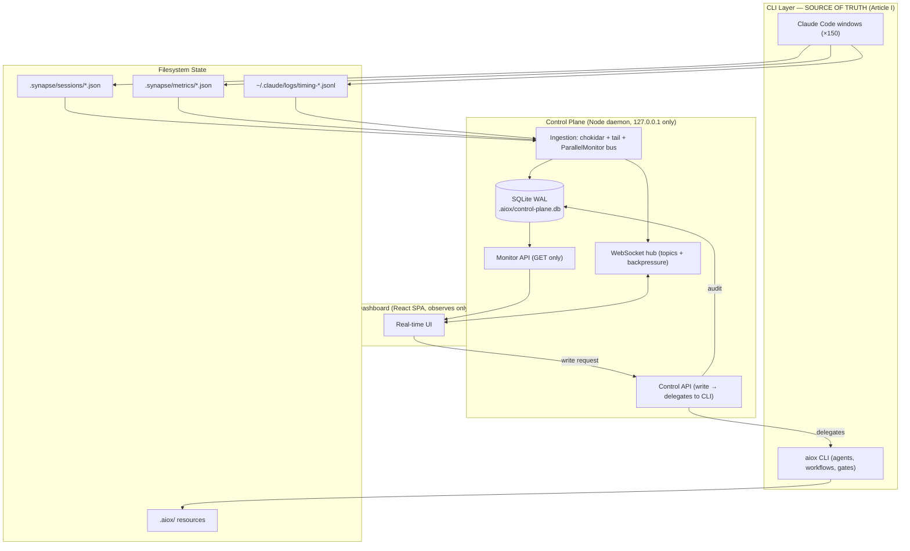
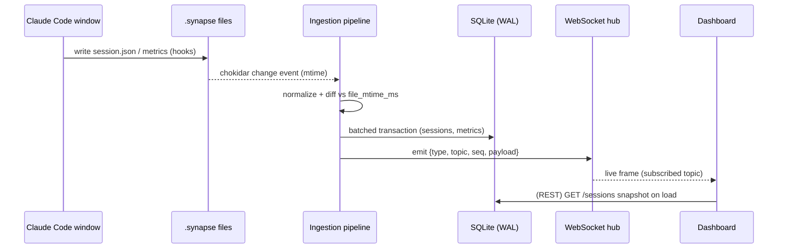
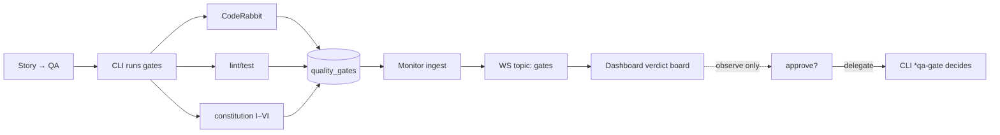
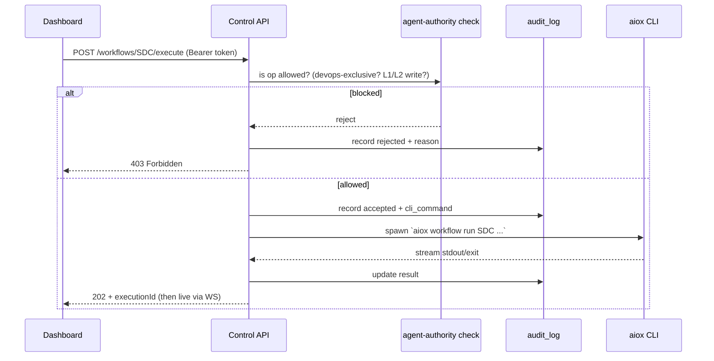

# Control Plane Design — Claude Code Monitor + Local Control Plane

> **Author:** Aria (Architect) · **Date:** 2026-06-04 · **Status:** DRAFT for multi-agent validation
> **Mantra:** Arquitetura perfeita, execução pragmática, qualidade garantida por testes.

---

## 0. Executive Summary

This document specifies the architecture for an integrated control system over Claude Code agent
sessions, composed of two planes:

1. **Monitor Plane (READ-ONLY)** — observes sessions, tokens, costs, execution logs, quality gates.
2. **Control Plane (WRITE)** — creates agents/squads, executes workflows, mutates `.aiox/` resources.

The system is **localhost-only**, **constitution-first** (CLI is source of truth, dashboard observes),
and **fully auditable**. It scales to **150+ concurrent terminal windows** via an event-driven,
file-watch + WAL-backed ingestion pipeline.

### Anchoring to existing reality (No Invention — Article IV)

This design does **not** start from zero. It formalizes and extends artifacts that already exist:

| Existing artifact | Path | Role in this design |
|-------------------|------|---------------------|
| `ParallelMonitor` (EventEmitter + `wsConnections` + `broadcast()`) | `.aiox-core/core/execution/parallel-monitor.js` | Becomes the in-process event bus the Control Plane subscribes to. **Preserved, not replaced.** |
| Session state files (`schema_version: "2.0"`) | `.synapse/sessions/*.json` | Canonical session source of truth the Monitor ingests. Shape is reused verbatim. |
| Hook metrics | `.synapse/metrics/hook-metrics.json` | Source for token/cost/timing aggregation. |
| Timing logs (JSONL) | `~/.claude/logs/timing-*.jsonl` | Per-tool execution timing feed (PreToolUse/PostToolUse). |
| Constitution (Art. I–VI) | `.aiox-core/constitution.md` | Quality-gate enforcement contract. |
| CodeRabbit integration | `.claude/rules/coderabbit-integration.md` | Code-review gate definition. |
| Agent authority matrix | `.claude/rules/agent-authority.md` | Authorization rules for Control API write ops. |

**Capability preservation guarantee:** The existing WebSocket broadcast pattern in `ParallelMonitor`
(`registerWave`, `task_started`, `task_output`, `task_completed`, `wave_completed`) is the kernel of
the real-time layer. We do not lose granularity — we add a durable ingestion and query layer in front of it.

---

## 1. Tech Stack Proposal

### 1.1 Backend Runtime — **Node.js** ✅ (DECISION)

**A/B/C trade-off:**

| Option | Pros | Cons | Verdict |
|--------|------|------|---------|
| **A. Node.js** | Same runtime as AIOX core (`parallel-monitor.js`, all `.aiox-core/` scripts are Node), zero context switch for `@dev`, native EventEmitter reuse, single `package.json`, matches Kairos Check prod stack (Railway/Node) | Single-threaded CPU work needs worker_threads for heavy aggregation | **CHOSEN** |
| B. Python (FastAPI) | Great async, rich data libs | Introduces a second runtime, second dependency tree, IPC bridge to read Node-produced session JSON, violates "single stack" pragmatism | Rejected |
| C. Go | Best raw concurrency for 150+ streams | Team has Go preset but project core is Node; rewriting `ParallelMonitor` event bus in Go = capability duplication + coupling | Rejected (revisit only if Node WS layer measurably saturates) |

**Rationale (ADR-001):** The entire AIOX core and the existing monitor are Node. Article I (CLI First)
and the No-Invention principle both push toward reusing the existing `ParallelMonitor`. Introducing
Python/Go would fork the event model. Node + `worker_threads` for aggregation covers the scale target.

- **HTTP framework:** **Fastify** (not Express) — 2–3× throughput, native JSON schema validation
  (we get OpenAPI-aligned request validation for free), first-class WebSocket plugin (`@fastify/websocket`).
- **Process model:** single Control Plane daemon (`aiox control-plane`) + `worker_threads` pool for
  aggregation/archival. No clustering needed for localhost; bind to `127.0.0.1` only.

### 1.2 Database — **SQLite (WAL mode)** ✅ (DECISION), Postgres as escape hatch

| Option | Pros | Cons | Verdict |
|--------|------|------|---------|
| **A. SQLite (WAL)** | Zero-install (single file `.aiox/control-plane.db`), embedded in Node via `better-sqlite3` (synchronous, fastest), WAL = concurrent readers + 1 writer (perfect for "many windows read, monitor writes"), trivial backup/crash-recovery, no daemon | Single-writer; very high write fan-in needs a write queue (we have one) | **CHOSEN** |
| B. PostgreSQL | True multi-writer, matches prod | Requires a running server on dev machine, overkill for localhost observability, operational weight contradicts "pragmatic execution" | Escape hatch only |
| C. In-memory / JSON files | Simplest | No queryable indexing for 150 windows, no crash recovery, loses history | Rejected |

**Rationale (ADR-002):** The workload is **write-funnel, read-fan-out**: ONE monitor process writes
events; MANY dashboard/CLI readers query. SQLite WAL is the textbook fit — readers never block the
writer, the writer is serialized through one process anyway. A single file gives us trivial crash
recovery (WAL replay) and backup. Postgres is available behind a `DatabaseAdapter` interface
(config-toggle) for the day someone wants a networked multi-machine fleet — **but that is YAGNI today.**

- **Driver:** `better-sqlite3` (synchronous, prepared statements, ~10× faster than async wrappers for
  this funnel pattern). Wrapped behind a `DatabaseAdapter` so Postgres can be swapped via config.
- **Write strategy:** single writer thread + bounded in-memory queue + batched transactions
  (flush every 50ms OR 200 events, whichever first). This is what lets 150 windows not thrash the disk.

### 1.3 Real-time Transport — **WebSocket** ✅ (DECISION)

| Option | Pros | Cons | Verdict |
|--------|------|------|---------|
| **A. WebSocket** | Already implemented in `ParallelMonitor.broadcast()`, bidirectional, browser-native (dashboard), low overhead, works over localhost trivially | Needs reconnect/backpressure handling (we specify it) | **CHOSEN** |
| B. gRPC (+ gRPC-Web) | Strong typing, streaming | Browser needs a proxy (Envoy/grpc-web), heavy toolchain, contradicts existing WS code, no real benefit on localhost | Rejected |
| C. SSE (Server-Sent Events) | Dead simple, auto-reconnect | One-way only (server→client); Control API needs client→server commands → would need a second channel | Rejected as primary; used as fallback |

**Rationale (ADR-003):** `ParallelMonitor` already speaks WebSocket. Reusing it honors No-Invention and
Capability Preservation. gRPC's typing benefit is nullified by needing a browser proxy on localhost.
We add **topic-based subscriptions** and **backpressure** on top of the existing broadcast.

- **Library:** `ws` (already the de-facto pairing with the existing `wsConnections` Set).
- **Protocol:** JSON frames `{ type, topic, seq, ts, payload }`. Clients subscribe to topics
  (`sessions`, `session:<id>`, `metrics`, `gates`, `workflows`). Server tracks per-connection
  high-water mark and drops to **snapshot+resync** if a slow client falls > N frames behind.

### 1.4 Frontend — **React + Vite + TypeScript** ✅ (DECISION, defer to UX expert for component design)

| Option | Pros | Cons | Verdict |
|--------|------|------|---------|
| **A. React + Vite** | Matches active preset `nextjs-react`, team knows it, Zustand already in stack (gotchas confirm Zustand usage), huge real-time/chart ecosystem | SPA boilerplate | **CHOSEN** |
| B. Vue | Fine framework | Off-stack, no team familiarity, off-preset | Rejected |
| C. Next.js (full) | Preset default | SSR is pointless for a localhost real-time observability SPA; adds a server we don't need | Rejected — use Vite SPA, not Next server |

**Rationale (ADR-004):** The dashboard is a **client-side real-time SPA** talking to localhost over WS.
SSR/Next server features add nothing here, so we use Vite (faster dev, lighter) while staying inside the
React + TypeScript + Zustand stack the preset and gotchas already establish.

- **State:** Zustand (heed gotchas: typed `create<T>()(persist(...))`, await hydration).
- **Data fetching for REST:** React Query (`@tanstack/react-query`) — heed gotcha: check `response.ok`.
- **Effects:** all subscriptions use the cleanup pattern from gotcha `STORY-7.4-TEST-353c57b`.
- **Handoff to UX (Uma):** component hierarchy, layout, visual system, and accessibility are **delegated**.
  This document defines only the **data contracts** the frontend consumes (Sections 2 & 3).

### 1.5 Stack Summary

```
┌─ Backend ──────────────────────────────────────────────┐
│ Node.js 20+ · Fastify · @fastify/websocket + ws         │
│ better-sqlite3 (WAL) · worker_threads (aggregation)     │
│ chokidar (file-watch) · ajv (schema validation)         │
└─────────────────────────────────────────────────────────┘
┌─ Data ─────────────────────────────────────────────────┐
│ SQLite WAL → .aiox/control-plane.db                     │
│ DatabaseAdapter abstraction → Postgres escape hatch     │
└─────────────────────────────────────────────────────────┘
┌─ Frontend (→ UX expert) ───────────────────────────────┐
│ React 18 + Vite + TypeScript · Zustand · React Query    │
│ WebSocket client w/ resync · recharts/visx for metrics  │
└─────────────────────────────────────────────────────────┘
```

---

## 2. API Design

Two surfaces, hard-separated to enforce **Article I (CLI First)**: the Monitor API can NEVER mutate
state; all mutation flows through the Control API, which **delegates to the CLI**, never executes
business logic itself.

> **Auth model (localhost):** Server binds to `127.0.0.1` only. A per-boot **bearer token** is written
> to `.aiox/control-plane.token` (chmod 600 / restricted ACL). Every request must send
> `Authorization: Bearer <token>`. WebSocket auth via `?token=` on the upgrade request, validated before
> the socket is accepted. No network auth, no users/passwords — the security boundary is the loopback
> interface + the OS file permission on the token. CSRF is mitigated by the bearer-token requirement
> (browser can't read the token file without explicit injection by the dashboard build).

### 2.1 Monitor API (READ-ONLY) — `GET` only

```
GET  /api/v1/sessions                       List sessions (filter: status, agent, since)
GET  /api/v1/sessions/:id                    Single session snapshot
GET  /api/v1/sessions/:id/logs               Execution log lines (paginated, cursor)
GET  /api/v1/sessions/:id/timeline           Tool-call timeline (from timing JSONL)
GET  /api/v1/metrics                          Aggregate metrics (tokens, cost, duration)
GET  /api/v1/metrics/series                   Time-series for charts (bucketed)
GET  /api/v1/agents                           Agent registry + activation stats
GET  /api/v1/squads                           Squad registry
GET  /api/v1/workflows                        Workflow executions (status, waves)
GET  /api/v1/workflows/:id                     Single workflow execution detail
GET  /api/v1/gates                             Quality-gate results (CodeRabbit, lint, constitution)
GET  /api/v1/gates/:id                         Single gate result
GET  /api/v1/audit                             Audit log (every write op, immutable)
GET  /api/v1/health                            Liveness + ingestion lag
```

**Enforcement:** the Monitor router is mounted with a middleware that rejects any method ≠ GET with
`405 Method Not Allowed`. This is a structural guarantee, not a convention.

### 2.2 Control API (WRITE) — delegates to CLI

```
POST   /api/v1/agents                         Create agent  → invokes `aiox agent create` (CLI)
POST   /api/v1/squads                          Create squad  → invokes `aiox squad create` (CLI)
POST   /api/v1/workflows/:name/execute         Execute workflow → invokes `aiox workflow run`
POST   /api/v1/workflows/:id/cancel            Cancel running workflow (delegates to ParallelMonitor)
POST   /api/v1/sessions/:id/commands           Queue a *-command for a session (advisory)
PATCH  /api/v1/aiox/config                      Mutate .aiox/ config (guarded by L1-L4 boundary)
```

**Critical constraint (Article I + agent-authority.md):**
- The Control API is a **thin delegator**. It validates input, checks authority (e.g. `git push` /
  `gh pr` are **rejected** — only `@devops` via CLI), writes an audit record, then **spawns the CLI**
  and streams the result. It contains **zero domain logic**. The dashboard cannot bypass the CLI.
- Operations blocked at the API layer regardless of caller: `git push`, `gh pr create/merge`, MCP
  add/remove (these are `@devops`-exclusive and must run through the CLI agent flow, never a UI button).

### 2.3 OpenAPI Schema Sample (excerpt)

```yaml
openapi: 3.1.0
info: { title: AIOX Control Plane API, version: 1.0.0 }
servers: [{ url: http://127.0.0.1:7420/api/v1 }]
components:
  securitySchemes:
    LocalBearer: { type: http, scheme: bearer }
security: [{ LocalBearer: [] }]
paths:
  /sessions:
    get:
      summary: List sessions
      parameters:
        - { name: status, in: query, schema: { enum: [active, idle, completed, crashed] } }
        - { name: agent,  in: query, schema: { type: string } }
        - { name: since,  in: query, schema: { type: string, format: date-time } }
      responses:
        "200":
          content:
            application/json:
              schema:
                type: object
                properties:
                  sessions: { type: array, items: { $ref: "#/components/schemas/Session" } }
                  total: { type: integer }
  /workflows/{name}/execute:
    post:
      summary: Execute a workflow (delegates to CLI)
      requestBody:
        content:
          application/json:
            schema:
              type: object
              required: [args]
              properties:
                args: { type: object }
                dryRun: { type: boolean, default: false }
      responses:
        "202": { description: Accepted; execution queued, returns executionId }
        "403": { description: Operation blocked by agent-authority (e.g. devops-exclusive) }
components:
  schemas:
    Session:
      type: object
      required: [uuid, schema_version, started, status]
      properties:
        uuid: { type: string, format: uuid }
        schema_version: { type: string, example: "2.0" }
        label: { type: string }
        status: { enum: [active, idle, completed, crashed] }
        started: { type: string, format: date-time }
        last_activity: { type: string, format: date-time }
        prompt_count: { type: integer }
        active_agent:
          type: object
          properties:
            id: { type: string, nullable: true }
            activated_at: { type: string, nullable: true }
        context:
          type: object
          properties:
            last_bracket: { enum: [MINIMAL, MODERATE, RICH, FULL] }
            last_tokens_used: { type: integer }
            last_context_percent: { type: number }
```

> Note: the `Session` schema mirrors the **real** `.synapse/sessions/*.json` shape (verified against
> `267395d4-…json`), satisfying No-Invention.

---

## 3. Data Model

SQLite is the **derived/queryable index**, not the source of truth. Source of truth remains the
filesystem (`.synapse/sessions/*.json`, CLI). The DB is rebuildable from a full re-scan — important for
crash recovery (Section 6).

### 3.1 Tables

```sql
-- sessions: mirror of .synapse/sessions/*.json, enriched with derived fields
CREATE TABLE sessions (
  uuid            TEXT PRIMARY KEY,            -- from session file
  schema_version  TEXT NOT NULL,
  label           TEXT,
  title           TEXT,
  cwd             TEXT,
  status          TEXT NOT NULL DEFAULT 'idle' -- active|idle|completed|crashed
                  CHECK (status IN ('active','idle','completed','crashed')),
  active_agent_id TEXT,                         -- FK-ish to agents.id (soft)
  active_workflow TEXT,
  active_squad    TEXT,
  last_bracket    TEXT,
  prompt_count    INTEGER NOT NULL DEFAULT 0,
  tokens_used     INTEGER NOT NULL DEFAULT 0,   -- derived from metrics
  cost_usd        REAL    NOT NULL DEFAULT 0,   -- derived
  started_at      TEXT NOT NULL,                -- ISO-8601
  last_activity   TEXT NOT NULL,
  file_mtime_ms   INTEGER NOT NULL,             -- for change detection / reconciliation
  ingested_at     TEXT NOT NULL
);

-- agents: registry snapshot (from .synapse/agent-* + .aiox-core)
CREATE TABLE agents (
  id           TEXT PRIMARY KEY,   -- 'dev','qa','architect',...
  persona      TEXT,               -- 'Dex','Quinn','Aria',...
  scope        TEXT,
  source_path  TEXT,
  is_exclusive INTEGER NOT NULL DEFAULT 0,  -- e.g. devops=1 (push/PR exclusive)
  created_at   TEXT NOT NULL
);

-- squads
CREATE TABLE squads (
  id          TEXT PRIMARY KEY,
  chief       TEXT,               -- activation handle, e.g. '@business-chief'
  domain      TEXT,
  source_path TEXT,
  created_at  TEXT NOT NULL
);

-- workflow_executions: extends ParallelMonitor wave/task model into durable rows
CREATE TABLE workflow_executions (
  id           TEXT PRIMARY KEY,            -- executionId / waveId
  workflow_id  TEXT NOT NULL,               -- 'SDC','qa-loop','spec-pipeline',...
  session_uuid TEXT REFERENCES sessions(uuid) ON DELETE SET NULL,
  status       TEXT NOT NULL                -- pending|running|completed|failed|cancelled
               CHECK (status IN ('pending','running','completed','failed','cancelled')),
  triggered_by TEXT,                        -- agent or 'cli' or 'control-api'
  args_json    TEXT,
  started_at   TEXT,
  finished_at  TEXT,
  created_at   TEXT NOT NULL
);

-- workflow_tasks: per-task rows (mirror ParallelMonitor activeTasks)
CREATE TABLE workflow_tasks (
  id            TEXT PRIMARY KEY,
  execution_id  TEXT NOT NULL REFERENCES workflow_executions(id) ON DELETE CASCADE,
  agent         TEXT,
  description   TEXT,
  status        TEXT NOT NULL DEFAULT 'pending',
  started_at    TEXT,
  finished_at   TEXT
);

-- quality_gates: CodeRabbit / lint / test / constitution results
CREATE TABLE quality_gates (
  id           TEXT PRIMARY KEY,
  session_uuid TEXT REFERENCES sessions(uuid) ON DELETE SET NULL,
  story_id     TEXT,
  gate_type    TEXT NOT NULL                -- coderabbit|lint|test|constitution
               CHECK (gate_type IN ('coderabbit','lint','test','constitution')),
  verdict      TEXT NOT NULL                -- PASS|CONCERNS|FAIL|WAIVED|BLOCKED
               CHECK (verdict IN ('PASS','CONCERNS','FAIL','WAIVED','BLOCKED')),
  severity     TEXT,                        -- CRITICAL|HIGH|MEDIUM|LOW (for coderabbit)
  article      TEXT,                        -- 'I'..'VI' for constitution gates
  details_json TEXT,
  created_at   TEXT NOT NULL
);

-- metrics: append-only time-series of token/cost/timing events
CREATE TABLE metrics (
  id           INTEGER PRIMARY KEY AUTOINCREMENT,
  session_uuid TEXT REFERENCES sessions(uuid) ON DELETE CASCADE,
  ts           TEXT NOT NULL,               -- event time
  metric       TEXT NOT NULL,               -- tokens_in|tokens_out|cost_usd|tool_ms
  value        REAL NOT NULL,
  tool         TEXT,                        -- for tool_ms
  agent        TEXT
);

-- audit_log: immutable record of EVERY Control API write (Article: auditability)
CREATE TABLE audit_log (
  id           INTEGER PRIMARY KEY AUTOINCREMENT,
  ts           TEXT NOT NULL,
  actor        TEXT NOT NULL,               -- 'control-api' + originating client
  action       TEXT NOT NULL,               -- create_agent|execute_workflow|...
  target       TEXT,
  args_json    TEXT,
  cli_command  TEXT,                        -- the exact CLI command delegated to
  result       TEXT NOT NULL,               -- accepted|rejected|completed|failed
  reason       TEXT                         -- e.g. 'devops-exclusive blocked'
);
```

### 3.2 Relationships (ER summary)

```
agents 1───* sessions            (active_agent_id, soft ref)
sessions 1───* metrics           (CASCADE delete)
sessions 1───* quality_gates     (SET NULL)
sessions 1───* workflow_executions (SET NULL)
workflow_executions 1───* workflow_tasks (CASCADE)
audit_log                        (standalone, append-only, never deleted)
```

### 3.3 Indexing Strategy (for 150+ concurrent windows)

The hot path is: dashboard polls/streams "all active sessions + their live metrics". Indexes target that.

```sql
-- Session listing & filtering (the dashboard's main query)
CREATE INDEX idx_sessions_status_activity ON sessions(status, last_activity DESC);
CREATE INDEX idx_sessions_agent           ON sessions(active_agent_id);
CREATE INDEX idx_sessions_mtime           ON sessions(file_mtime_ms);  -- reconciliation scans

-- Metrics time-series (charts + per-session aggregation)
CREATE INDEX idx_metrics_session_ts ON metrics(session_uuid, ts);
CREATE INDEX idx_metrics_metric_ts  ON metrics(metric, ts);           -- fleet-wide series

-- Gates dashboard
CREATE INDEX idx_gates_session   ON quality_gates(session_uuid, created_at DESC);
CREATE INDEX idx_gates_verdict   ON quality_gates(verdict);

-- Workflow board
CREATE INDEX idx_wf_status ON workflow_executions(status, started_at DESC);
CREATE INDEX idx_tasks_exec ON workflow_tasks(execution_id);
```

**Why this scales to 150 windows:**
- 150 sessions is a *tiny* row count. The challenge is **write frequency**, not row count.
- Writes are funneled through ONE writer thread with **batched transactions** (50ms/200-event flush).
  150 windows emitting ~1 event/sec = ~150 events/sec → ~7–8 batched transactions/sec. Trivial for WAL.
- Reads use covering indexes; WAL lets all 150 readers query without blocking the writer.
- **Metrics rollups:** a worker thread pre-aggregates `metrics` into 1-min buckets (`metrics_rollup`
  materialized table) so chart queries never scan raw rows. Raw `metrics` older than 24h are archived
  (reuse the Sprint 2 `DailyUsage Archival` pattern already in the codebase — capability reuse, IDS).

---

## 4. Integration Points

### 4.1 Claude Code CLI → Control Plane (ingestion)

Three complementary feeds, layered for resilience:

| # | Feed | Mechanism | Latency | Reliability role |
|---|------|-----------|---------|------------------|
| 1 | **Session files** | `chokidar` watch on `.synapse/sessions/*.json` | ~ms on write | Canonical state; survives Control Plane restart |
| 2 | **In-process events** | Subscribe to `ParallelMonitor` EventEmitter + WS broadcast | real-time | Live wave/task/log streaming |
| 3 | **Timing JSONL** | Tail `~/.claude/logs/timing-*.jsonl` | ~ms | Per-tool execution timeline & gaps |

```
┌──────────────┐  writes JSON   ┌────────────────────┐
│ Claude Code  │───────────────▶│ .synapse/sessions/ │
│   session    │                └─────────┬──────────┘
│  (window N)  │  hook metrics            │ chokidar watch
│              │───────────────▶ .synapse/metrics/    │
└──────┬───────┘  PreToolUse/Post         │
       │ timing JSONL                      ▼
       │              ┌──────────────────────────────────┐
       └─────────────▶│         INGESTION PIPELINE        │
                      │  watcher → normalizer → WAL queue │
                      │       → batch writer (SQLite)     │
                      └───────────────┬──────────────────┘
                                      │ emits normalized events
                                      ▼
                      ┌──────────────────────────────────┐
                      │   ParallelMonitor (event bus)     │  ◀── existing artifact
                      │   broadcast() → WS subscribers    │
                      └───────────────┬──────────────────┘
                                      ▼  WS frames
                            Dashboard / CLI readers
```

### 4.2 Session state sync (tokens, costs, logs)

- **Reconciliation loop:** every Control Plane boot performs a **full scan** of `.synapse/sessions/*.json`,
  comparing each file's `mtime` against `sessions.file_mtime_ms`. Stale/missing rows are re-ingested.
  This makes the DB **eventually consistent with the filesystem** and recoverable after any crash.
- **Token/cost derivation:** `hook-metrics.json` + timing JSONL → `metrics` rows → rolled up into
  `sessions.tokens_used` / `sessions.cost_usd`. Cost = tokens × model-rate from a config table
  (`.aiox/model-rates.yaml`, L4 mutable — **no hardcoded prices**, per architect-first rule).
- **Crash detection:** a session with `status=active` whose `last_activity` is older than a heartbeat
  threshold (e.g. 90s with no file mtime change) is transitioned to `crashed` by a reaper job.

### 4.3 Remote control of `.aiox/` resources

- All mutations go through Control API → **CLI delegation** → filesystem. The dashboard never writes
  `.aiox/` files directly.
- **L1–L4 boundary enforcement:** `PATCH /aiox/config` consults the boundary toggle
  (`core-config.yaml → boundary.frameworkProtection`). Any write targeting L1 (`.aiox-core/core/`)
  or L2 (templates/tasks) is **rejected with 403** and an audit record — same deny rules as
  `.claude/settings.json`. Only L3 (config) and L4 (runtime) paths are writable, and even those
  go through the CLI so existing validation gates fire.

### 4.4 Real-time event streaming

- **Topics:** `sessions`, `session:<id>`, `metrics`, `gates`, `workflows`, `audit`.
- **Frame format:**

```json
{
  "type": "task_completed",
  "topic": "workflows",
  "seq": 10427,
  "ts": "2026-06-04T12:00:03.114Z",
  "payload": { "executionId": "wave-7", "taskId": "t3", "agent": "dev", "status": "completed" }
}
```

- **Backpressure:** server tracks per-connection ACK/high-water. If a client lags > 500 frames, the
  server stops incremental frames, sends one `snapshot` frame (current state of subscribed topic), and
  resumes from the live `seq` — preventing memory blowup with 150 windows. (This directly hardens the
  existing `broadcast()` which currently fan-outs unconditionally.)
- **Reconnect:** client reconnects with `?since=<seq>`; server replays from a bounded ring buffer or
  falls back to snapshot if `seq` is evicted.

---

## 5. Quality Gate Checkpoints

Gates are **observed** by the Monitor and **enforced** by the CLI/agents — the dashboard shows status,
it never approves. This is the heart of Article I compliance.

### 5.1 CodeRabbit integration

- Mirrors `.claude/rules/coderabbit-integration.md`: dev phase (light, max 2 iter, CRITICAL/HIGH
  auto-fix), QA phase (full, max 3 iter).
- Results land in `docs/qa/coderabbit-reports/` → ingested into `quality_gates` rows
  (`gate_type='coderabbit'`, `severity`, `verdict`).
- Dashboard shows per-story CodeRabbit verdict + iteration count + outstanding HIGH/CRITICAL.

### 5.2 Lint / test validation before story approval

- `gate_type='lint'` and `gate_type='test'` rows recorded from CLI runs (`npm run lint`, `npm test`).
- A story cannot transition to `Done` while any `FAIL` gate is open (enforced by the **CLI** QA-gate
  task, surfaced — not enforced — by the dashboard).

### 5.3 Constitution validation (Art. I–VI)

| Article | Gate check (recorded as `gate_type='constitution'`, `article=`) |
|---------|-----------------------------------------------------------------|
| I CLI First | Verify no write op bypassed CLI (cross-check `audit_log.cli_command` non-null on every mutation) |
| II Agent Authority | Reject UI-initiated `git push`/`gh pr`/MCP ops (devops-exclusive) — 403 + audit |
| III Story-Driven | Workflow execution must reference a story id when applicable |
| IV No Invention | Spec/gate traceability flag (advisory in dashboard) |
| V Quality First | Aggregate of lint+test+coderabbit gates |
| VI Absolute Imports | Lint rule result feed |

**Gate flow:**

```
Story moves to QA ──▶ CLI runs gates ──▶ writes quality_gates rows ──▶ Monitor ingests
                                                                          │
                          Dashboard shows verdict board ◀─── WS 'gates' ──┘
                                                                          │
   Control API: approve story?  ──▶  DELEGATES to CLI `*qa-gate` ────────▶ (CLI decides)
                                       (dashboard cannot self-approve)
```

---

## 6. Scalability

### 6.1 Handle 150+ terminal windows

| Pressure | Mitigation |
|----------|------------|
| 150 session files watched | Single `chokidar` watcher with `awaitWriteFinish` debounce; O(changed) not O(all) per event |
| Write fan-in | One writer thread + bounded queue + 50ms/200-event batched transactions (WAL) |
| Read fan-out | WAL concurrent readers; covering indexes; rollup table for charts |
| WS connections | Topic subscriptions (clients get only what they view) + per-conn backpressure/resync |
| Memory | Bounded ring buffer for WS replay; raw metrics archived after 24h |

### 6.2 Real-time metric updates (tokens/costs)

- Tokens/costs streamed via `metrics` topic, debounced to **≤ 1 update/session/sec** at the server to
  avoid 150 windows × high-freq updates flooding the UI. Charts read pre-aggregated 1-min buckets.

### 6.3 Session persistence

- Source of truth is the filesystem; SQLite is a rebuildable index. Sessions survive Control Plane
  restarts because state lives in `.synapse/sessions/*.json`.

### 6.4 Crash recovery

| Failure | Recovery |
|---------|----------|
| Control Plane crashes | On reboot: WAL replay (SQLite) + full reconciliation scan vs file mtimes → DB consistent |
| SQLite file corrupt | Delete `.db` + full re-scan rebuilds it from filesystem (DB is derived, not authoritative) |
| Claude window crashes | Reaper marks session `crashed` after heartbeat timeout; no data loss |
| WS client disconnect | Reconnect with `?since=seq` → replay or snapshot resync |

---

## 7. Architecture Diagrams

### 7.1 System boundaries



### 7.2 Data flow (Claude Code → Monitor → Dashboard)



### 7.3 Quality gate flow



### 7.4 Control write flow (auditable delegation)



---

## 8. Architectural Decision Records (summary)

| ADR | Decision | Status |
|-----|----------|--------|
| ADR-001 | Backend = Node.js + Fastify (reuse existing event model, single stack) | Accepted |
| ADR-002 | Store = SQLite WAL (`better-sqlite3`), Postgres behind `DatabaseAdapter` escape hatch | Accepted |
| ADR-003 | Real-time = WebSocket (`ws`), extend existing `ParallelMonitor.broadcast()` | Accepted |
| ADR-004 | Frontend = React + Vite + TS + Zustand (on-preset, SPA not Next-server) | Accepted (UX delegated) |
| ADR-005 | DB is derived index; filesystem is source of truth (crash recovery via re-scan) | Accepted |
| ADR-006 | Control API is thin CLI delegator with audit log; dashboard never executes logic | Accepted (Article I) |

---

## 9. Security Implications (flagged)

1. **Loopback-only bind** (`127.0.0.1`) — never `0.0.0.0`. The single biggest control: no remote attack surface.
2. **Per-boot bearer token** in `.aiox/control-plane.token` with restricted file ACL; rotated each boot.
3. **No UI-executed privileged ops** — `git push`, `gh pr`, MCP mutations are 403 at the API (Article II).
4. **L1/L2 write protection** — boundary deny rules enforced server-side, mirroring `.claude/settings.json`.
5. **Immutable audit log** — every write attempt (accepted or rejected) recorded; never deleted.
6. **No secrets in DB** — model rates and tokens stay in config files / OS-protected token file.
7. **Command injection guard** — Control API builds CLI invocations via argv arrays (no shell string
   interpolation), validating every arg against the OpenAPI schema (ajv) before spawn.

---

## 10. Trade-offs & Open Questions (for validation)

**Trade-offs accepted:**
- SQLite single-writer caps theoretical write throughput — acceptable because writes are funneled
  through one monitor process anyway. Escape hatch to Postgres exists if a multi-machine fleet emerges.
- Vite SPA (not Next) sacrifices SSR — irrelevant for a localhost observability tool.

**Open questions (need PO/User input):**
1. **Token/cost rates source** — confirm `.aiox/model-rates.yaml` is acceptable, or pull from an API?
2. **History retention** — 24h raw + indefinite rollups assumed; confirm retention policy.
3. **Multi-machine future** — is 150 windows always on ONE machine? If a fleet across machines is real,
   that flips ADR-002 toward Postgres now rather than later.
4. **Dashboard auth beyond localhost** — if dashboard is ever exposed beyond loopback, the whole auth
   model must change (this design explicitly assumes localhost-only).

---

## 11. Next Steps (pragmatic execution)

1. Validate this design with **PO (Pax)** and **User** (multi-agent validation — architect-first stop rule).
2. **UX expert (Uma)** designs dashboard components against the data contracts in Sections 2–3.
3. **Data engineer (Dara)** reviews/owns the detailed DDL, migrations, and rollup strategy (Section 3).
4. Spike: bind a minimal Fastify + `ws` daemon to the existing `ParallelMonitor` (POC, time-boxed) to
   de-risk the ingestion→broadcast→DB loop before full formalization (risk-mitigation: POC before formalize).
5. Define test strategy (safety net): ingestion idempotency, reconciliation correctness, 403-on-blocked-ops,
   WS backpressure under 150 simulated windows.

---
*End of CONTROL-PLANE-DESIGN.md*
