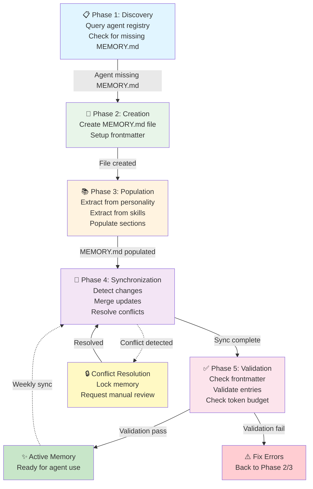
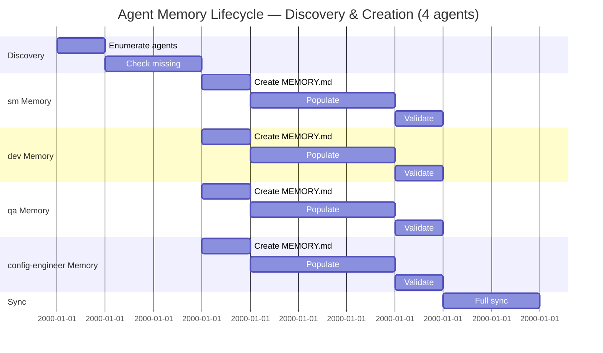

# Agent Memory Lifecycle — Mermaid Diagram



---

## Detailed Flow

```mermaid
flowchart LR
    subgraph Discovery["Phase 1: Discovery"]
        D1["Enumerate agents<br/>from registry"]
        D2["Check MEMORY.md<br/>existence"]
        D3["Classify as<br/>has/needs memory"]
    end
    
    subgraph Creation["Phase 2: Creation"]
        C1["Create directory<br/>.claude/agents/{id}/"]
        C2["Create MEMORY.md<br/>with frontmatter"]
        C3["Set version & date"]
    end
    
    subgraph Population["Phase 3: Population"]
        P1["Read agent<br/>personality"]
        P2["Extract from<br/>skill files"]
        P3["Read CLAUDE.md<br/>if exists"]
        P4["Classify to memory<br/>types"]
        P5["Populate sections<br/>in MEMORY.md"]
    end
    
    subgraph Sync["Phase 4: Synchronization"]
        S1["Detect changes<br/>in sources"]
        S2["Check for<br/>conflicts"]
        S3["Merge updates<br/>by timestamp"]
        S4["Log all changes<br/>in audit trail"]
    end
    
    subgraph Validation["Phase 5: Validation"]
        V1["✓ Frontmatter valid"]
        V2["✓ Entries present"]
        V3["✓ Token budget OK"]
        V4["✓ No duplicates"]
    end
    
    D1 --> D2 --> D3
    D3 -->|needs memory| C1
    C1 --> C2 --> C3
    C3 --> P1
    P1 --> P2 --> P3 --> P4 --> P5
    P5 --> S1
    S1 --> S2 --> S3 --> S4
    S4 --> V1 --> V2 --> V3 --> V4
    V4 -->|Pass| Success["✨ Agent memory active"]
    V4 -->|Fail| Retry["⚠️ Fix issues"]
    
    style Discovery fill:#e1f5ff,stroke:#01579b
    style Creation fill:#e8f5e9,stroke:#1b5e20
    style Population fill:#fff3e0,stroke:#e65100
    style Sync fill:#f3e5f5,stroke:#4a148c
    style Validation fill:#fce4ec,stroke:#880e4f
    style Success fill:#c8e6c9,stroke:#2e7d32
    style Retry fill:#ffcdd2,stroke:#b71c1c
```



---

## State Machine

```mermaid
stateDiagram-v2
    [*] --> Discovery
    
    Discovery --> Creation: Agent needs memory
    Discovery --> Active: Memory exists
    
    Creation --> Population: File created
    Population --> Sync: Populated
    Sync --> Validation: Synced
    
    Validation --> Active: ✅ Pass
    Validation --> FixErrors: ❌ Fail
    
    FixErrors --> Population: Issues fixed
    
    Active --> Sync: Weekly sync trigger
    
    Sync --> ConflictCheck{Conflicts?}
    ConflictCheck --> Manual: Yes
    ConflictCheck --> Validation: No
    
    Manual --> Resolved{Resolved?}
    Resolved --> Sync: Yes
    Resolved --> Manual: No (waiting)
    
    Active --> [*]
```

---

## Timeline Example (4 Agents)



---

## AC Coverage Map

| AC | Diagram Section | Details |
|----|-----------------|---------|
| **AC1:** Structure | State Machine, Timeline | Phases 1-2 show structure creation |
| **AC2:** Discovery | Discovery Flow, Timeline | Discovery Phase (1) fully detailed |
| **AC3:** Population Workflow | Population Flow, Timeline | Phase 3 shows extraction + population |
| **AC4:** Sync Rules | State Machine, Sync Flow | Phase 4 shows sync + conflict handling |

---

**All diagrams render in standard Mermaid format — embed in docs/diagrams/ or wiki**
