# AIOX Mastery Roadmap — 100% Core Compliance

Este guia contém o mapa de desenvolvimento completo para dominar o framework **AIOX** em 4 níveis estruturados. Seguir este fluxo garante domínio absoluto do sistema de multi-agentes e execução de código sem desvios das diretrizes constitucionais.

---

## 📊 O Mapa Completo de Mestria (Mermaid)

Pressione **`Ctrl + Shift + V`** (ou `Cmd + Shift + V` no macOS) no VS Code para abrir a Pré-visualização do Markdown e ver o diagrama renderizado.

```mermaid
flowchart TD
    %% Styling
    classDef start_end fill:#fdfefe,stroke:#7f8c8d,stroke-width:2px,color:#2c3e50;
    classDef l1 fill:#e8f4f8,stroke:#006699,stroke-width:1px,color:#003366;
    classDef l2 fill:#eafaf1,stroke:#2ecc71,stroke-width:1px,color:#145a32;
    classDef l3 fill:#fef9e7,stroke:#f1c40f,stroke-width:1px,color:#7d6608;
    classDef l4 fill:#f5eef8,stroke:#9b59b6,stroke-width:1px,color:#4a235a;
    classDef decision fill:#fff3cd,stroke:#ffc107,stroke-width:1.5px,color:#856404;

    Start(["Início da Jornada AIOX"]):::start_end --> L1["NÍVEL 1: INICIANTE (Setup & Filosofia)"]:::l1
    
    %% Nível 1 details
    L1 --> L1_1["1.1 Ler a Constituição (.aiox-core/constitution.md)"]:::l1
    L1_1 --> L1_2["1.2 Dominar as 5 Regras de Ouro"]:::l1
    L1_2 --> L1_3["1.3 Executar npx aiox-core doctor (Diagnóstico)"]:::l1
    L1_3 --> L1_4["1.4 Executar npm run sync:ide (Sincronizar IDE)"]:::l1
    
    L1_4 --> Q1{"AIOX Status\nVerde (GREEN)?"}:::decision
    Q1 -- Não --> L1_3
    Q1 -- Sim --> L2["NÍVEL 2: INTERMEDIÁRIO (Ciclo SDC & Dev)"]:::l2
    
    %% Nível 2 details
    L2 --> L2_1["2.1 Story-Driven Development (SDC)"]:::l2
    L2_1 --> L2_2["2.2 Criar Story com o @sm (*draft)"]:::l2
    L2_2 --> L2_3["2.3 Validação de Story pelo @po (10-point checklist)"]:::l2
    L2_3 --> L2_4["2.4 Auto-Worktree (Desenvolvimento em Branch Isolado)"]:::l2
    L2_4 --> L2_5["2.5 Implementação pelo @dev (*develop-story)"]:::l2
    L2_5 --> L2_6["2.6 Quality Gates e Testes Unitários"]:::l2
    L2_6 --> L2_7["2.7 CodeRabbit Self-Healing Loop"]:::l2
    L2_7 --> L2_8["2.8 QA Gate pelo @qa (*qa-gate)"]:::l2
    L2_8 --> L2_9["2.9 Push Seguro pelo @devops (*push)"]:::l2
    
    L2_9 --> Q2{"Consegue rodar SDC\nsem nenhuma quebra?"}:::decision
    Q2 -- Não --> L2_1
    Q2 -- Sim --> L3["NÍVEL 3: AVANÇADO (Arquitetura & Complexidade)"]:::l3
    
    %% Nível 3 details
    L3 --> L3_1["3.1 Spec Pipeline (Complexity >= 9)"]:::l3
    L3_1 --> L3_2["3.2 Dimensionar Complexidade (5 dimensões do AIOX)"]:::l3
    L3_2 --> L3_3["3.3 Pesquisa de Dependências pelo @analyst"]:::l3
    L3_3 --> L3_4["3.4 Escrever Especificação pelo @pm (Art. IV Block Gate)"]:::l3
    L3_4 --> L3_5["3.5 Crítica de Spec pelo @qa (APPROVED/NEEDS_REVISION)"]:::l3
    L3_5 --> L3_6["3.6 Plano de Implementação pelo @architect"]:::l3
    L3_6 --> L3_7["3.7 Reuso Inteligente com IDS (check reuse)"]:::l3
    L3_7 --> L3_8["3.8 Auditoria de Legado com Brownfield Discovery (10 fases)"]:::l3
    
    L3_8 --> Q3{"Domina Specs,\nIDS e Discovery?"}:::decision
    Q3 -- Não --> L3_1
    Q3 -- Sim --> L4["NÍVEL 4: MESTRE (Orquestração & Customização)"]:::l4
    
    %% Nível 4 details
    L4 --> L4_1["4.1 Orquestração de Sprints e Epics (*execute-epic-plan)"]:::l4
    L4_1 --> L4_2["4.2 Customização de Workflows e Tasks personalizados"]:::l4
    L4_2 --> L4_3["4.3 Criação e Gestão de Equipes (Squad Creator)"]:::l4
    L4_3 --> L4_4["4.4 Configuração de Regras Globais no Synapse Engine"]:::l4
    L4_4 --> L4_5["4.5 Governança de Constituição e Framework com @aiox-master"]:::l4
    
    L4_5 --> End(["MESTRIA TOTAL (AIOX Master - 100%)"]):::start_end
```

---

## 🧭 Detalhamento dos Níveis para Domínio de 100%

### 🟦 Nível 1: Iniciante — Fundações, Setup e Regras de Ouro
O objetivo deste nível é ter um repositório perfeitamente configurado e alinhado aos princípios fundamentais do AIOX.

* **Princípios para Dominar:**
  * **Constituição AIOX (Art. I a VI):** A lei que rege todas as operações dos agentes.
  * **Hierarquia "CLI First":** CLI (`aiox` e comandos CLI) > Observabilidade (Dashboards) > UI (Telas).
  * **As 5 Regras de Ouro:** Story-Driven, CLI-First, No Invention, Agent Authority, Quality First.
* **Comandos Essenciais:**
  * `npx aiox-core doctor` — Executa 15 testes de integridade do repositório.
  * `npm run sync:ide` — Sincroniza atalhos e comandos na IDE do desenvolvedor.
  * `npm run validate:structure` / `npm run validate:agents` — Valida a conformidade das estruturas de dados e agentes locais.
* **Critério de Conclusão (100% Verde):** Executar `npx aiox-core doctor` e não ter nenhum aviso ou erro na saída.

---

### 🟩 Nível 2: Intermediário — Ciclo SDC e Desenvolvimento
O objetivo deste nível é implementar novas funcionalidades e corrigir bugs sem desvios do ciclo de desenvolvimento de software do AIOX.

* **Conceitos Chave:**
  * **SDC (Story Development Cycle):** O ciclo padrão em que as tarefas passam de SM para PO, Dev, QA e DevOps.
  * **Auto-Worktree:** O branch isolado gerado para cada story para evitar conflitos de merge.
  * **QA Loop:** O ciclo iterativo de revisão entre QA e Dev (máximo 5 iterações).
* **Fluxo de Trabalho:**
  1. `@sm` (River) rascunha a story com `*draft {story-id}`.
  2. `@po` (Pax) valida e atribui status **Ready** se passar na checklist de 10 pontos.
  3. `@dev` (Dex) cria o worktree e desenvolve usando `*develop-story {story-id}`.
  4. Lógicas de testes unitários (`npm test`) e verificações locais de qualidade (`lint`, `typecheck`).
  5. **CodeRabbit Self-Healing Loop:** Validação contra vulnerabilidades e erros graves.
  6. `@qa` (Quinn) analisa e emite veredicto `PASS` no `*qa-gate`.
  7. `@devops` (Gage) faz o commit, push e abre o Pull Request (`*push`).
* **Critério de Conclusão (100% Verde):** Entregar pelo menos 3 stories seguidas sem nenhuma infração registrada no painel de auditoria do AIOX.

---

### 🟨 Nível 3: Avançado — Planejamento, IDS e Legados
O objetivo deste nível é liderar projetos complexos, reaproveitar código por meio do sistema IDS e lidar com a reestruturação de sistemas legados.

* **Conceitos Chave:**
  * **Spec Pipeline:** O fluxo obrigatório para qualquer história/feature com complexidade maior ou igual a 9.
  * **Classificação de Complexidade:** Avaliação pontual de 1 a 5 em Scope, Integration, Infrastructure, Knowledge e Risk.
  * **IDS (Entity Registry & Principles):** O motor de inteligência de código. Antes de criar, o AIOX exige verificar se a funcionalidade já existe (`REUSE > ADAPT > CREATE`).
  * **Brownfield Discovery:** O workflow em 10 fases para mapeamento, análise de banco de dados e UX de um projeto herdado.
* **Comandos Essenciais:**
  * `*create-spec {story-id}` — Inicia o fluxo de 6 fases do Spec Pipeline.
  * `*db-schema-audit` — Realiza auditoria profunda de tabelas e políticas de segurança RLS (Data Engineer).
  * `*ids check "ideia a implementar"` — Consulta o catálogo de entidades para ver se a estrutura já foi criada.
* **Critério de Conclusão (100% Verde):** Elaborar uma especificação complexa aprovada de primeira pelo QA Gate e consolidar uma auditoria de arquitetura legada.

---

### 🟪 Nível 4: Mestre — Orquestração, Customização e Regras do Motor
O objetivo deste nível é customizar a arquitetura dos agentes, criar novos workflows no AIOX, customizar regras e governar o framework.

* **Conceitos Chave:**
  * **Epic Wave Orchestration:** Planejamento e execução de ondas paralelas de desenvolvimento em sprints organizados.
  * **Squad Creator:** Criação de novos squads de agentes baseados em domínios específicos (ex.: squad de machine learning, squad de finanças).
  * **Synapse Engine:** O núcleo que injeta regras globais e locais diretamente nos prompts de todos os agentes.
  * **Governador de Constituição:** Modificar e atualizar a Constituição do AIOX.
* **Comandos Essenciais:**
  * `*create-epic "NOME_DO_EPIC"` — Criação de um novo épico para organizar histórias e dependências.
  * `*execute-epic-plan` — Inicia e acompanha a execução em onda dos sprints.
  * `/Chiefs:agents:squad-chief` — Ativação do criador de squads para novos agentes.
  * `*kb` — Ativa o modo de base de conhecimento global (usado apenas por `@aiox-master` para modificar a estrutura do framework).
* **Critério de Conclusão (100% Verde):** Criar um workflow personalizado com regras de injeção Synapse customizadas e rodar o pipeline integrado com sucesso.

---

## 🚫 Desvios Frequentes a Evitar (Atenção Máxima)

1. **Codificar sem Story:** Alterar código na raiz do projeto diretamente. O AIOX bloqueia isso no Gate de SDC. Crie sempre a story antes.
2. **Git Push por Outros Agentes:** Executar git push usando a persona do `@dev`. Apenas o `@devops` (Gage) tem permissão de push. Delegue para ele.
3. **Ignorar Erros de Lint/Typecheck:** Tentar mesclar código quebrando regras do compilador. O pipeline de push bloqueia isso sem bypass.
4. **Criar Código Redundante:** Criar um componente ou Helper sem rodar `*ids check`. Isso gera dívida técnica e desvia do princípio do AIOX de reúso.
