# Fluxo de Criação de Squad de Elite com AIOX (Architect & Framework)

Este guia ensina o passo a passo prático, acompanhado de um diagrama Mermaid, de **como usar as ferramentas do AIOX** (especificamente o agente `@squad-creator`) para desenhar, configurar e ativar um **Squad de Elite** especialista em arquitetura, frameworks e diagramas.

> [!IMPORTANT]
> **REGRA DE OURO DE CONFORMIDADE:** De acordo com o Artigo III da Constituição AIOX (*Story-Driven Development*), nenhuma alteração no repositório (incluindo criação de novos agentes, configurações de squads ou pastas) pode ser feita sem uma **Story validada**. A chamada ao `squad-creator` deve ocorrer **dentro** da fase de desenvolvimento de uma Story.

---

## 📊 Processo de Criação do Squad com SDC (Mermaid)

Pressione **`Ctrl + Shift + V`** (ou `Cmd + Shift + V` no macOS) no VS Code para abrir a Pré-visualização do Markdown e ver o diagrama renderizado.

```mermaid
flowchart TD
    %% Styling
    classDef user fill:#fff3cd,stroke:#ffc107,stroke-width:2px,color:#856404;
    classDef agent fill:#e8f4f8,stroke:#006699,stroke-width:2px,color:#003366;
    classDef artifact fill:#fff9c4,stroke:#fbc02d,stroke-width:1.5px,color:#f57f17;
    classDef process fill:#fafafa,stroke:#757575,stroke-width:1px,color:#212121;
    classDef success fill:#e8f5e9,stroke:#388e3c,stroke-width:2.5px,color:#1b5e20;
    classDef gate fill:#f5eef8,stroke:#9b59b6,stroke-width:2px,color:#4a235a;

    Start(["Início: Demanda por Novo Squad"]) --> P1_STORY["Fase 1: @sm cria Story para o Squad\n(Comando: *draft create-squad-architect)"]:::process
    
    %% Validação de Story
    P1_STORY --> P1_VAL["Fase 2: @po valida a Story\n(10-point checklist)"]:::gate
    P1_VAL --> C0{"Veredicto GO\n(Status = Ready)?"}:::gate
    C0 -- Não --> P1_STORY
    
    %% Início do Desenvolvimento (Ativação do Criador)
    C0 -- Sim --> U1["Fase 3: @dev inicia a implementação da Story\ne aciona o Criador de Squads\n(Comando: /squad-creator)"]:::user

    %% Análise do Squad Creator
    U1 --> A1["Fase 4: @squad-creator inicia interface interativa\nsolicitando os requisitos do squad"]:::agent
    A1 --> U2["Usuário define a missão:\n'Squad de Elite em Arquitetura, Stacks e Diagramas'"]:::user

    %% Design de DNA e Personas
    U2 --> A2["Fase 5: AIOX desenha o DNA das Personas do Squad:\n- Define perfis dos Especialistas Reais\n- Mapeia responsabilidades e limites\n- Cria arquivos squads/architect-squad.yaml"]:::agent
    A2 --> SpecSquad["squads/architect-squad.yaml\n(Definição de papéis)"]:::artifact

    %% Criação de Skills e Regras
    SpecSquad --> A3["Fase 6: AIOX gera as Skills e Regras do Squad:\n- Comandos em .aiox-core/development/tasks/\n- Pastas de memória .claude/agent-memory/\n- Regras de injeção em .synapse/"]:::agent
    A3 --> AgentConfig["Ficheiros criados:\n- task: create-architecture-spec.md\n- task: generate-diagram-mermaid.md\n- rules: .synapse/architect-squad.json"]:::artifact

    %% Validação Técnica e QA Gate
    AgentConfig --> A4["Fase 7: Executar Teste de Coerência do Squad\n(Comando: npx aiox-core doctor\nou node squads/validate-squad.js)"]:::process
    A4 --> C1{"Squad passa nos\ntestes de estrutura?"}:::agent
    C1 -- Não --> E_FIX["Corrigir definições ou referências de arquivos"]:::process --> A4
    C1 -- Sim --> V2["Fase 8: @qa valida as especificações\ne aprova a Story no *qa-gate\n(Status = Done)"]:::gate

    %% Instalação e Ativação via DevOps
    V2 --> A5["Fase 9: @devops registra e ativa o Squad no Core\n(Comando: npm run sync:skills:codex\ne executa o *push para a main)"]:::agent
    A5 --> ActiveSquad["SQUAD REGISTRADO E ATIVO\n(Disponível na main de forma segura)"]:::success

    %% Apply CSS
    class U1,U2 user;
    class A1,A2,A3,A5,C1,C0 agent;
    class P1_VAL,V2 gate;
    class SpecSquad,AgentConfig,ActiveSquad success;
```



---

## 👥 1. O Desenho dos Especialistas Reais deste Squad (DNA)

Ao criar o squad de arquitetura e diagramas, o AIOX configurará as seguintes personas de experts de mercado para cooperarem entre si:

### 📐 A. Lead Software Architect (Aria)
*   **DNA/Especialidade:** Especialista em DDD (Domain-Driven Design), modelagem de dados, arquiteturas corporativas e mapeamento de dependências.
*   **Papel no Squad:** Atuar como o líder técnico, consolidando as especificações de design e definindo o fluxo principal de chamadas de API.
*   **Regras de Execução:** Proibida de escrever código funcional (`src/`). Deve focar estritamente em arquivos `docs/` e `architecture.md`.

### 🔬 B. Tech Stack & Framework Analyst (Atlas)
*   **DNA/Especialidade:** Especialista em pesquisa competitiva de tecnologia, benchmarks de performance, auditorias de segurança de bibliotecas e compatibilidades de ecossistemas (ex: npm, Docker, Supabase).
*   **Papel no Squad:** Identificar dependências e validar se a tecnologia recomendada é viável e segura.
*   **Regras de Execução:** Deve verificar o histórico e reputação das bibliotecas antes de aprová-las na spec.

### 🎨 C. Component & Layout Architect (Uma)
*   **DNA/Especialidade:** Especialista em frontend moderno (Next.js, Tailwind), Design Systems (Atomic Design) e acessibilidade (WCAG AA).
*   **Papel no Squad:** Desenhar e detalhar a árvore de componentes visuais do frontend e o mapeamento de tokens de design.
*   **Regras de Execução:** Garantir compatibilidade cross-platform (responsividade mobile/tablet) nas especificações.

### 🗺️ D. Visual Cartographer (Orion / Custom Diagrammer)
*   **DNA/Especialidade:** Especialista em modelagem visual e sintaxe Mermaid.js.
*   **Papel no Squad:** Receber as especificações escritas das APIs, banco de dados e rotinas e transformá-las em diagramas Mermaid claros, visualizáveis e sintaticamente perfeitos.
*   **Regras de Execução:** Validar a sintaxe dos diagramas antes de escrevê-los no arquivo markdown final.

---

## 🛠️ 2. Passo a Passo Completo do Processo (Com SDC)

Siga estes passos exatos para garantir que o AIOX crie o seu novo squad mantendo 100% de conformidade com a Constituição:

### Passo 1: Criar a Story no Backlog
Peça ao Scrum Master (`@sm`) para criar um rascunho de Story focado na criação do novo squad:
```bash
*draft "Criar Squad de Elite para Arquitetura e Diagramação"
```
* Isso criará um arquivo de story em `docs/stories/`.

### Passo 2: Obter Validação do PO
Peça ao Product Owner (`@po`) para auditar a Story criada:
```bash
*validate-story-draft docs/stories/story-X.X-criar-squad-arquitetura.md
```
* Se passar na checklist de 10 pontos (GO), o status mudará de **Draft** para **Ready**.

### Passo 3: Iniciar Desenvolvimento e Chamar o Squad Creator
Com a Story no estado **Ready**, ative o `@dev` para iniciar a implementação. Nesse estágio de desenvolvimento, acione a ferramenta interativa de criação de squads:
```bash
/squad-creator
```
Forneça a descrição da missão técnica ao assistente:
> *"Quero criar um Squad de Elite em Arquitetura, Stacks e Diagramação. A equipe deve conter 4 agentes especializados: Aria (Lead Architect), Atlas (Tech Analyst), Uma (UX Designer) e Orion (Diagrammer). A squad deve mapear dependências, desenhar modelos de dados e fluxos de processos usando Mermaid, e gerar pacotes de handoff estruturados para os desenvolvedores."*

### Passo 4: Executar Teste de Coerência (npx aiox-core doctor)
Após a criação dos arquivos de DNA, skills e regras do squad, execute a validação geral:
```bash
npx aiox-core doctor
```
Certifique-se de que os novos arquivos estão listados como **PASS**.

### Passo 5: Quality Gate da Story (QA Gate)
Peça ao `@qa` (Quinn) para auditar a implementação do novo squad:
```bash
*qa-gate docs/stories/story-X.X-criar-squad-arquitetura.md
```
Se a estrutura de pastas e skills do novo squad estiver perfeita, o status mudará para **Done**.

### Passo 6: Registrar na IDE e dar Push na Main
Com o status **Done**, o `@devops` (Gage) roda o comando de registro e faz o commit seguro para o repositório remoto:
```bash
npm run sync:skills:codex
*push
```
Pronto! Seu novo squad de arquitetura estará **oficialmente ativo e integrado** na main.
