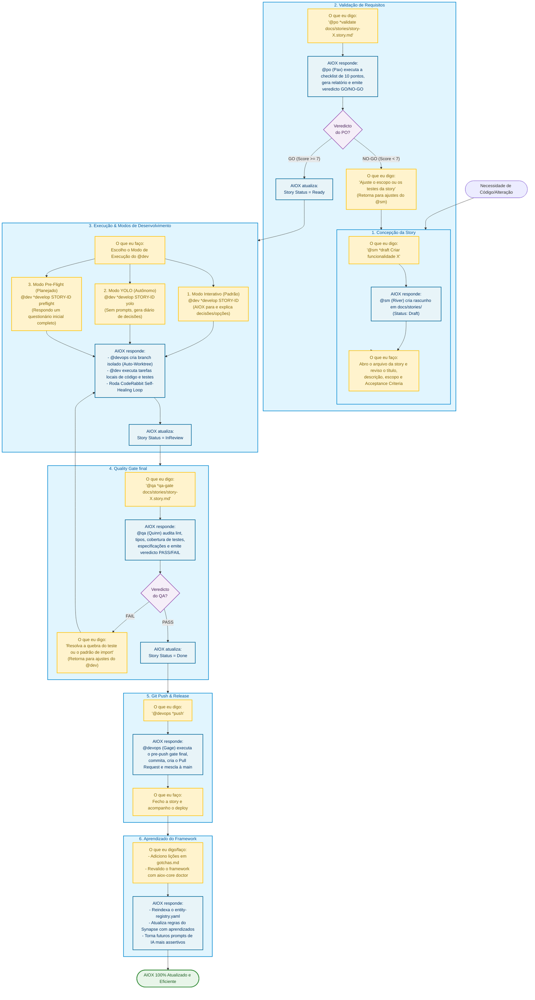

# Guia Interativo: Como Trabalhar no SDC (Story-Driven Cycle) com o AIOX

Este guia mapeia de forma exaustiva o fluxo de colaboração entre **você (o Usuário)** e o **AIOX** em um ciclo orientado a histórias (*Story-Driven Cycle*). Ele detalha exatamente o que dizer, o que fazer em cada fase, como o AIOX responde sob o capô, e como esse ciclo retroalimenta e melhora o próprio framework.

---

## 📊 O Ciclo Interativo Completo (Mermaid)

Pressione **`Ctrl + Shift + V`** (ou `Cmd + Shift + V` no macOS) no VS Code para abrir a Pré-visualização do Markdown e ver o diagrama renderizado.



---

## 💬 1. O que eu digo (Instruções e Comandos CLI)

Para cada fase, use estes comandos exatos para falar com o AIOX:

### Fase 1: Criação da Story
```bash
*draft "Nome do que você quer fazer"
```
*   *Quem escuta:* `@sm` (River - Scrum Master).
*   *Exemplo:* `*draft "Adicionar validação de CPF no checkout"`

### Fase 2: Validação de Requisitos
```bash
*validate docs/stories/story-X.X-nome-da-story.md
```
*   *Quem escuta:* `@po` (Pax - Product Owner).

### Fase 3: Desenvolvimento
Você escolhe como o `@dev` (Dex) deve se comportar durante o código:
1.  **Modo Padrão (Interativo):**
    ```bash
    *develop STORY-ID
    ```
    *O AIOX vai parar e pedir sua validação a cada decisão de arquitetura ou escolha de biblioteca.*
2.  **Modo YOLO (Autônomo - Rápido):**
    ```bash
    *develop STORY-ID yolo
    ```
    *O AIOX toma as decisões sozinho de forma ágil e gera um log detalhado das decisões (.ai/decision-log-STORY-ID.md).*
3.  **Modo Pre-Flight (Planejado):**
    ```bash
    *develop STORY-ID preflight
    ```
    *O AIOX lhe faz todas as perguntas técnicas no início (questionário) e depois executa tudo sem interromper.*

### Fase 4: Quality Gate
```bash
*qa-gate docs/stories/story-X.X-nome-da-story.md
```
*   *Quem escuta:* `@qa` (Quinn - Quality Assurance).

### Fase 5: Push e Deploy
```bash
*push
```
*   *Quem escuta:* `@devops` (Gage - CI/CD Specialist).

---

## 🛠️ 2. O que eu faço (Responsabilidade do Desenvolvedor)

Como parceiro de programação da inteligência artificial, você é o **diretor** do processo. Suas responsabilidades manuais são:

1.  **Rever as Stories criadas:** Abra o arquivo `.md` em `docs/stories/` para garantir que o escopo e os critérios de aceitação descrevem exatamente o que você deseja.
2.  **Responder a Checkpoints (Modo Interativo/Pre-Flight):** Quando o AIOX perguntar sobre escolhas técnicas (como escolher entre usar uma biblioteca existente ou criar do zero), forneça respostas claras com base na sua preferência.
3.  **Visualizar os Diagramas:** Abra a visualização de Markdown (`Ctrl + Shift + V`) nos arquivos gerados pelo AIOX para auditar graficamente o fluxo do sistema.
4.  **Registrar "Gotchas" (Aprendizados):** Se você descobrir alguma pegadinha no código ou um comportamento estranho, anote em `.claude/gotchas.md`. O AIOX lê esse arquivo em todas as sessões para evitar repetir erros do passado.

---

## 📈 3. Como Isso Melhora o Próprio AIOX?

Trabalhar de forma Story-Driven rígida cria um **ciclo de feedback positivo** que aprimora o framework AIOX continuamente:

*   **Menos Alucinação (No Invention):** O Artigo IV obriga o AIOX a consultar o `requirements.json` e o `research.json` antes de codificar. Isso impede que ele invente funções inexistentes ou adicione dependências redundantes.
*   **Reúso Inteligente (IDS Gates):** Ao indexar novos códigos no `entity-registry.yaml`, a IA saberá exatamente o que já existe nas próximas tarefas. Isso previne duplicação e reduz o tamanho do repositório.
*   **Memória Coletiva (Gotchas & Memory):** Conforme novas lições são escritas, a base de conhecimento do framework cresce, tornando as respostas futuras dos agentes 50% mais rápidas e precisas.
