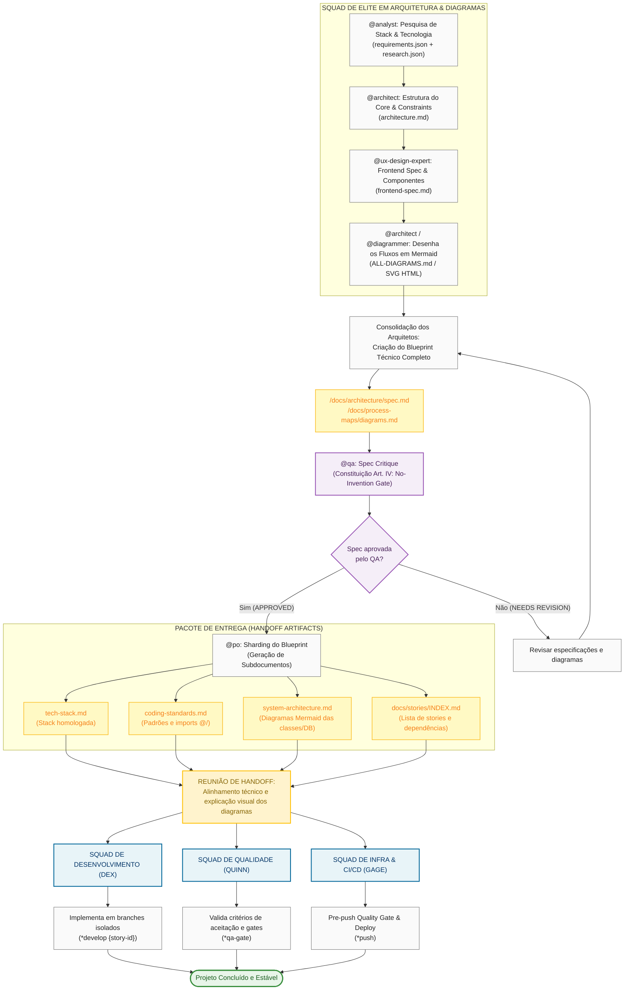

# Squad de Elite: Arquitetura, Frameworks e Diagramação (AIOX Blueprint)

Este guia descreve como organizar, configurar e operar um **Squad de Elite** focado em **Arquitetura, Frameworks e Diagramação**. Este squad atua como o "Cérebro" do projeto, encarregado de pesquisar stack, estruturar o sistema, desenhar os fluxogramas visuais em Mermaid e preparar as especificações técnicas (PRDs/Specs). 

Uma vez concluído o planejamento visual e arquitetural, este squad faz um **Handoff (Entrega)** estruturado de histórias de usuário e diretrizes para os squads de implementação.

---

## 📊 Ciclo de Vida e Fluxo de Handoff (Mermaid)

Pressione **`Ctrl + Shift + V`** (ou `Cmd + Shift + V` no macOS) no VS Code para abrir a Pré-visualização do Markdown e ver o diagrama renderizado.



---

## 👥 1. Membros e DNA do Squad de Arquitetura

Para configurar este squad usando o **Squad Creator** (`/Chiefs:agents:squad-chief`), os seguintes papéis e permissões devem ser configurados:

*   **`@architect` (Aria) - Líder da Squad**
    *   **Escopo:** Desenho do core do sistema, modelos de banco de dados, constraints técnicas e design de APIs.
    *   **Artefatos:** `architecture.md`, `system-architecture.md`.
*   **`@analyst` (Atlas) - O Pesquisador**
    *   **Escopo:** Auditoria de stacks existentes, pesquisa de mercado sobre tecnologias de ponta, análise de dependências e validação de viabilidade técnica.
    *   **Artefatos:** `requirements.json`, `research.json`.
*   **`@ux-design-expert` (Uma) - O Especialista em Frontend**
    *   **Escopo:** Criação da especificação de telas, mapeamento de componentes atômicos (atomic design), design tokens e auditorias de acessibilidade.
    *   **Artefatos:** `frontend-spec.md`, `ux-specialist-review.md`.
*   **`@diagrammer` (Custom Agent) - O Cartógrafo Visual**
    *   **Escopo:** Traduzir especificações de banco de dados, fluxos de chamadas HTTP e rotinas de backend em diagramas Mermaid visualizáveis.
    *   **Artefatos:** `ALL-DIAGRAMS.md`.

---

## 📦 2. O Pacote de Handoff (Checklist 100% Pronto)

O Handoff é considerado concluído e **100% seguro contra desvios** quando o Squad de Elite emite e assina eletronicamente os seguintes arquivos na pasta [docs/](file:///c:/Users/lealp/KAIROS_CEREBRO/docs/):

*   [ ] **`system-architecture.md`**: Diagrama Mermaid completo de entidade-relacionamento (banco de dados) e fluxo de dados.
*   [ ] **`tech-stack.md`**: Declaração explícita das bibliotecas autorizadas (nenhuma biblioteca fora desta lista pode ser instalada pelo Dev).
*   [ ] **`coding-standards.md`**: Regras de nomenclatura, uso de imports absolutos (`@/`) e padrões de tratamento de erro.
*   [ ] **`docs/stories/INDEX.md`**: O roadmap do projeto shardado, mapeando exatamente quais stories dependem de quais (Grafo de dependências).
*   [ ] **`validation_gates.json`**: Definição automática de testes e lints que a esteira de push do DevOps deve exigir.

---

## ⚙️ 3. Como Iniciar um Novo Projeto com Este Squad

Para iniciar a criação com o Squad de Arquitetura, o usuário segue esta sequência CLI:

1.  **Requisitos Informais:** Forneça a ideia do projeto ou PRD inicial.
2.  **Pesquisa de Stack:**
    ```bash
    *create-spec "Minha Nova Feature"
    ```
    *(Este comando ativa o @pm e @analyst para levantar os requisitos e viabilidades tecnológicas).*
3.  **Desenho e Diagramação:** 
    *   O `@architect` elabora os diagramas Mermaid de fluxo e classes no arquivo de arquitetura.
4.  **Quality Gate da Spec:**
    *   O `@qa` realiza a crítica da especificação garantindo conformidade com a Constituição (Artigo IV: Proibido inventar código sem requisitos).
5.  **Sharding:**
    *   O `@po` divide a arquitetura aprovada em histórias de usuário menores prontas para a implementação do `@dev`.
