# AIOX Developer Workflow & Onboarding Guide

Este guia visual detalha o fluxo de trabalho passo a passo para configurar o **AIOX**, rodar os diagnósticos de saúde do repositório e desenvolver stories seguindo as **Regras de Ouro (Golden Rules)** para garantir que tudo corra bem e sem desvios de processo.

---

## 📊 Fluxo de Configuração e Trabalho (Mermaid)

Pressione **`Ctrl + Shift + V`** (ou `Cmd + Shift + V` no macOS) no VS Code para abrir a Pré-visualização de Markdown e ver o diagrama renderizado.

```mermaid
flowchart TD
    %% Styling
    classDef default fill:#f9f9f9,stroke:#333,stroke-width:1px;
    classDef success fill:#d4edda,stroke:#28a745,stroke-width:2px,color:#155724;
    classDef warning fill:#fff3cd,stroke:#ffc107,stroke-width:2px,color:#856404;
    classDef danger fill:#f8d7da,stroke:#dc3545,stroke-width:2px,color:#721c24;
    classDef step fill:#e2f0d9,stroke:#385723,stroke-width:1px;

    subgraph PHASE_1["1. PRE-FLIGHT (Configuração & Saúde)"]
        A["Abrir Repositório no VS Code"] --> B["Executar npx aiox-core doctor"]
        B --> C{"doctor passou\n(15 checks)?"}
        C -- Não --> D["Aplicar correções recomendadas"] --> B
        C -- Sim --> E["Sincronizar IDE:\nnpm run sync:ide"]
        E --> F["Validar Estrutura:\nnpm run validate:structure\nnpm run validate:agents"]
        F --> G["FRAMEWORK SAUDÁVEL (Verde)"]:::success
    end

    subgraph PHASE_2["2. INICIAR STORY (Sem Desvios)"]
        G --> H["Regra de Ouro: Story-Driven\n(Não codificar sem Story)"]
        H --> I["@sm cria rascunho:\n*draft {story-id}"]
        I --> J["@po valida a story\n(10-point checklist)"]
        J --> K{"GO verdict\n(pontuação >= 7/10)?"}
        K -- Não (NO-GO) --> L["@sm ajusta a story\n(Critérios de Aceitação/Escopo)"] --> J
        K -- Sim (GO) --> M["Story Status = Ready"]:::success
    end

    subgraph PHASE_3["3. DESENVOLVIMENTO ISOLADO"]
        M --> N["@dev ativa o Auto-Worktree\n(Branch isolado para a story)"]
        N --> O["Regra de Ouro: CLI First\n(Implementar CLI antes da UI)"]
        O --> P["@dev executa a implementação:\n*develop {story-id}"]
        P --> Q["Escrever Testes Unitários e Integrados"]
        Q --> R["Atualizar Lista de Ficheiros (File List) no story.md"]
        R --> S["Story Status = InReview"]:::warning
    end

    subgraph PHASE_4["4. QUALITY GATE (Segurança e Testes)"]
        S --> T["Executar Quality Gates locais:\nnpm run lint\nnpm run typecheck\nnpm test\nnpm run build"]
        T --> U["CodeRabbit Self-Healing Loop\n(Resolve bugs CRITICAL/HIGH)"]
        U --> V["@qa executa validação final:\n*qa-gate {story-id} (7 checks)"]
        V --> W{"QA Verdict?"}
        W -- FAIL --> X["Devolver para @dev com feedback"] --> P
        W -- PASS / CONCERNS --> Y["Story Status = Done"]:::success
    end

    subgraph PHASE_5["5. PUSH & DEPLOY"]
        Y --> Z["Regra de Ouro: Autoridade de Agente\n(Apenas DevOps envia código)"]
        Z --> AA["@devops executa:\n*push"]:::success
        AA --> AB["Código Mesclado e Produção Segura"]:::success
    end

    %% Apply CSS
    class G,M,Y,AA,AB success;
    class S,T,U,V warning;
    class D,L,X danger;
    class I,J,N,P step;
```

---

## 📋 Checklist Rápido de Sucesso (Sem Desvios)

Siga este checklist rigorosamente antes e durante cada ciclo de desenvolvimento:

### ⚙️ Fase 1: Validação de Configuração
* [ ] Rodei `npx aiox-core doctor` no início do dia e todos os 15 checks estão verdes.
* [ ] Rodei `npm run sync:ide` para alinhar hooks e comandos CLI.
* [ ] As validações `npm run validate:structure` e `npm run validate:agents` passaram sem erros.

### 📝 Fase 2: Gestão de Requisitos (Story-Driven)
* [ ] **Story Existe:** Existe um arquivo `.story.md` ou `.story.yaml` correspondente em [docs/stories/](file:///c:/Users/lealp/KAIROS_CEREBRO/docs/stories/).
* [ ] **Critérios de Aceitação (AC):** Os critérios estão escritos no formato *Given/When/Then* claro e testável.
* [ ] **Validação do PO:** A story foi validada pelo `@po` (Pax) com status **Ready** (GO ≥ 7/10).

### 🛠️ Fase 3: Desenvolvimento Limpo
* [ ] **Isolamento:** Estou trabalhando no branch isolado gerado automaticamente pelo **Auto-Worktree** (`auto-claude/{story-id}`).
* [ ] **CLI First:** Implementei a lógica básica, os testes e os comandos CLI antes de criar qualquer tela ou interface visual.
* [ ] **No Invention:** Todo o meu código atende estritamente às especificações definidas na story. Não inventei features extras.

### 🧪 Fase 4: Garantia de Qualidade
* [ ] Rodei `npm run lint` e corrigi todos os avisos de formatação e padrões.
* [ ] Rodei `npm run typecheck` e todos os tipos TypeScript estão válidos.
* [ ] Executei `npm test` e a cobertura de testes cobre as novas lógicas introduzidas.
* [ ] O **CodeRabbit** rodou o self-healing e corrigiu qualquer issue classificada como **CRITICAL** ou **HIGH**.
* [ ] O `@qa` aprovou a story via `*qa-gate` mudando o status para **Done**.

### 🚀 Fase 5: Entrega Autorizada
* [ ] Deleguei o envio do branch final ao agente **`@devops`** (Gage) para executar o `*push` (git push / pull request). *Nunca faça git push manualmente com outros agentes.*
