# Guia de Organização e Validação do Workspace (100% Saudável)

Este documento descreve o processo sistemático e avançado para organizar e validar todo o repositório **KAIROS_CEREBRO**, garantindo que o **AIOX** esteja totalmente configurado, atualizado e funcionando sem nenhuma inconsistência ou desvio de conformidade.

---

## 📊 Fluxograma de Auditoria e Resolução (Mermaid)

Pressione **`Ctrl + Shift + V`** (ou `Cmd + Shift + V` no macOS) no VS Code para abrir a Pré-visualização do Markdown e ver o diagrama renderizado.

```mermaid
flowchart TD
    %% Styling definitions
    classDef start_end fill:#fdfefe,stroke:#7f8c8d,stroke-width:2px,color:#2c3e50;
    classDef categoryL1 fill:#e1f5fe,stroke:#0288d1,stroke-width:2px,color:#01579b;
    classDef categoryL2 fill:#efebe9,stroke:#5d4037,stroke-width:1.5px,color:#3e2723;
    classDef process fill:#fafafa,stroke:#757575,stroke-width:1px,color:#212121;
    classDef check fill:#fff9c4,stroke:#fbc02d,stroke-width:2px,color:#f57f17;
    classDef success fill:#e8f5e9,stroke:#388e3c,stroke-width:2.5px,color:#1b5e20;
    classDef error fill:#ffebee,stroke:#c62828,stroke-width:2px,color:#b71c1c;

    Start(["Início da Auditoria Geral do Workspace"]):::start_end --> P1_SCAN["1. VARREDURA E LIMPEZA DE PASTAS"]:::categoryL1

    %% 1. Varredura e Limpeza
    subgraph LANE_A["PASTA & INTEGRIDADE FISICAL (Pasta Kairos Cerebro)"]
        P1_SCAN --> P1_1["Listar arquivos soltos na raiz (Ex: .env extras, zips, backups, .log)"]:::process
        P1_1 --> P1_2["Verificar integridade do .gitignore e .gitattributes"]:::process
        P1_2 --> P1_3["Auditar pastas no docs/ (stories, brownfield, process-maps)"]:::process
        P1_3 --> C1_CLEAN{"Existem ficheiros\nobsoletos/soltos?"}:::check
        C1_CLEAN -- Sim --> P1_FIX["Limpeza Manual/Script:\n- Apagar arquivos temporários\n- Organizar docs/ para as subpastas corretas"]:::process --> P1_1
        C1_CLEAN -- Não --> P2_DIAG["2. AUDITORIA CORE DO FRAMEWORK (AIOX CLI)"]:::categoryL1
    end

    %% 2. Execução de Diagnósticos
    subgraph LANE_B["DIAGNÓSTICOS E SAÚDE DO FRAMEWORK"]
        P2_DIAG --> P2_1["Executar npx aiox-core doctor"]:::process
        P2_1 --> C2_DOCTOR{"doctor retornou\nWARN ou FAIL?"}:::check
        
        %% Doctor Check outcomes
        C2_DOCTOR -- FAIL (settings, rules, paths, node) --> E2_DOCTOR_FAIL["Revisar arquivos cruciais de regras\n(Constitution, Settings, Agent-Memory)"]:::error --> P2_1
        C2_DOCTOR -- WARN (Ex: entity-registry > 48h) --> E2_DOCTOR_WARN["Atualizar o Registro de Entidades:\nnpx aiox-core install --force\nou npm run sync:skills:codex"]:::process --> P2_1
        C2_DOCTOR -- PASS (14/14 ou 15/15 PASS) --> P3_IDE["3. INTEGRATÓRIA E SKILLS DA IDE (Claude & Codex)"]:::categoryL1
    end

    %% 3. Integração e Skills IDE
    subgraph LANE_C["INTEGRAÇÃO DA IDE & ATALHOS CLAUDE CODE"]
        P3_IDE --> P3_1["Executar npm run validate:claude-integration"]:::process
        P3_1 --> P3_2["Executar npm run validate:claude-sync"]:::process
        P3_2 --> C3_SYNC{"Houve drift, skills ausentes\nou comandos órfãos?"}:::check
        C3_SYNC -- Sim (Erro / Drift) --> E3_SYNC["Forçar Sincronismo da IDE:\nnpm run sync:ide"]:::process --> P3_1
        C3_SYNC -- Não (PASS) --> P4_QUALITY["4. GATES DE QUALIDADE DO CÓDIGO (Compilação & Testes)"]:::categoryL1
    end

    %% 4. Código e Compilação
    subgraph LANE_D["COMPILAÇÃO, TIPOS & COBERTURA DE TESTES"]
        P4_QUALITY --> P4_1["Executar npm run lint (Absolutes, Imports, Formatação)"]:::process
        P4_1 --> P4_2["Executar npm run typecheck (Compilador TS sem emit)"]:::process
        P4_2 --> P4_3["Executar npm test (Suite unitária e de WebSocket)"]:::process
        P4_3 --> C4_QUALITY{"Algum erro de\nlint, tipos ou teste?"}:::check
        C4_QUALITY -- Sim (Falha) --> E4_QUALITY["Corrigir código, exportações\nou scripts de teste locais"]:::error --> P4_1
        C4_QUALITY -- Não (PASS) --> P5_STATE["5. ATUALIZAÇÃO DO ESTADO GLOBAL"]:::categoryL1
    end

    %% 5. Estado e Regras
    subgraph LANE_E["LOGGING & STATE TRACKING"]
        P5_STATE --> P5_1["Abrir e atualizar STATE.md (Sessão Atual)"]:::process
        P5_1 --> P5_2["Auditar e manter memória local (.claude/agent-memory/)"]:::process
        P5_2 --> C5_FINAL{"Estado Atualizado e\nDocumentado?"}:::check
        C5_FINAL -- Não --> E5_RULES["Inserir progresso do dia,\ncommits e status das stories no STATE.md"]:::process --> P5_1
        C5_FINAL -- Sim --> Done(["WORKSPACE 100% VERDE & ALINHADO"]):::success
    end

    %% Connectors
    class Start,Done success;
    class C1_CLEAN,C2_DOCTOR,C3_SYNC,C4_QUALITY,C5_FINAL check;
    class E2_DOCTOR_FAIL,E4_QUALITY error;
```



---

## 🗂️ 1. Organização e Limpeza de Pastas (`KAIROS_CEREBRO`)

Para manter o repositório organizado e em 100% de conformidade com o **AIOX Project Map** (Art. II - Codebase structure):

*   **Estrutura de Pastas Esperada (Audite e limpe periodicamente):**
    *   [`.aiox-core/`](file:///c:/Users/lealp/KAIROS_CEREBRO/.aiox-core/): Código core do framework (workflows, tasks, infraestrutura e CLI). **Imutável por desenvolvedores comuns (L1/L2).**
    *   [`bin/`](file:///c:/Users/lealp/KAIROS_CEREBRO/bin/): Pontos de entrada executáveis (CLI local `kairos.js`).
    *   [`packages/`](file:///c:/Users/lealp/KAIROS_CEREBRO/packages/): Subpacotes de lógica do projeto (ex.: `sniper-api`, `hyperdrive`, `web`).
    *   [`docs/`](file:///c:/Users/lealp/KAIROS_CEREBRO/docs/): Toda a documentação de arquitetura, stories, PRDs e relatórios de dívida técnica.
        *   [`docs/stories/`](file:///c:/Users/lealp/KAIROS_CEREBRO/docs/stories/): Histórias ativas e finalizadas do SDC.
        *   [`docs/brownfield/`](file:///c:/Users/lealp/KAIROS_CEREBRO/docs/brownfield/): Relatórios de auditoria e mapeamento de dívida técnica do legado.
        *   [`docs/process-maps/`](file:///c:/Users/lealp/KAIROS_CEREBRO/docs/process-maps/): Mapeamento de agentes e fluxos de processos AIOX.
    *   [`.synapse/`](file:///c:/Users/lealp/KAIROS_CEREBRO/.synapse/): Regras automáticas injetadas em prompts de IA.
    *   [`.claude/`](file:///c:/Users/lealp/KAIROS_CEREBRO/.claude/): Configurações de contexto e controle de comandos.
    *   [`tests/`](file:///c:/Users/lealp/KAIROS_CEREBRO/tests/): Conjuntos de testes de integração e cenários.

*   **Varredura contra Arquivos Soltos (Limpeza):**
    *   **Logs soltos:** Exclua ou mova para pasta de debug arquivos `.log` temporários ou zips da raiz.
    *   **Configurações temporárias:** Arquivos como `.env.backup` ou similares que não estão no `.gitignore` devem ser removidos ou movidos para diretórios seguros.

---

## 🔍 2. Lista Completa de Validações e Conformidades

Para verificar se o workspace está rodando a **100%**, execute a seguinte esteira de validações:

### Passo A: Diagnóstico de Saúde do Framework
```bash
npx aiox-core doctor
```
*   **Campos avaliados:**
    *   `settings-json`: Verifica as regras de bloqueio de escrita e exceções da IDE.
    *   `rules-files`: Verifica a presença de todos os 7 arquivos de regras obrigatórios.
    *   `agent-memory`: Garante os arquivos `MEMORY.md` para os 10 agentes core.
    *   `entity-registry`: Garante que o catálogo de entidades está atualizado (< 48h).
    *   `git-hooks`: Instalação dos hooks Git (`pre-commit` e `pre-push`).
    *   `ide-sync`: Sincronismo das skills locais e comandos.

### Passo B: Sincronização e Validação da IDE
```bash
npm run validate:claude-integration
npm run validate:claude-sync
```
*   **Campos avaliados:**
    *   Confirma que as 12 skills de agentes do Claude e os 12 comandos legados estão sincronizados na IDE local sem qualquer drift (inconsistências de versão).

### Passo C: Auditoria de Estrutura de Código e Cobertura
```bash
npm run typecheck
npm test
```
*   **Campos avaliados:**
    *   Verifica se o projeto inteiro possui erros de compilação TypeScript (typecheck) e se a suite completa de testes passa sem regressões.

---

## 🚨 Checklist de Tratamento de Inconsistências (Outdated / Failures)

Use esta lista para corrigir falhas e manter o repositório em conformidade:

| Se o teste falhar em: | Causa Comum | Como Resolver |
|---|---|---|
| **`entity-registry` (WARN)** | Registro de entidades local com mais de 48 horas de idade. | Rode o comando `npx aiox-core install --force` (se abrir um menu de wizard interativo, você pode cancelá-lo após ele atualizar o registry, ou rodar `npm run sync:skills:codex` para atualizar dependências). |
| **`ide-sync` (FAIL/DRIFT)** | Atalhos da IDE ou comandos locais do Claude Code desatualizados. | Rode `npm run sync:ide` para alinhar as ferramentas. |
| **`settings-json` (FAIL)** | Regras de bloqueio ou permissão da IDE modificadas na raiz. | Verifique se as configurações em `.claude/settings.json` estão de acordo com `.aiox-core/constitution.md`. |
| **`node-version` (FAIL)** | Versão incorreta do runtime utilizada no terminal. | Certifique-se de estar usando o Node.js v18 ou superior. |
| **`validate:structure` (FAIL)** | Ficheiro de story ou task colocado na pasta errada. | Mova os rascunhos para `docs/stories/` e as tarefas para `.aiox-core/development/tasks/`. |
