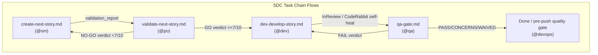
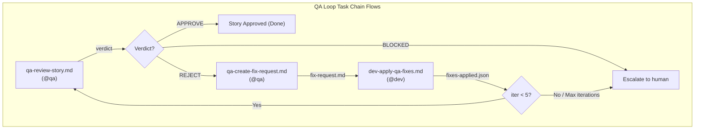
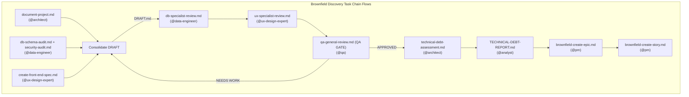
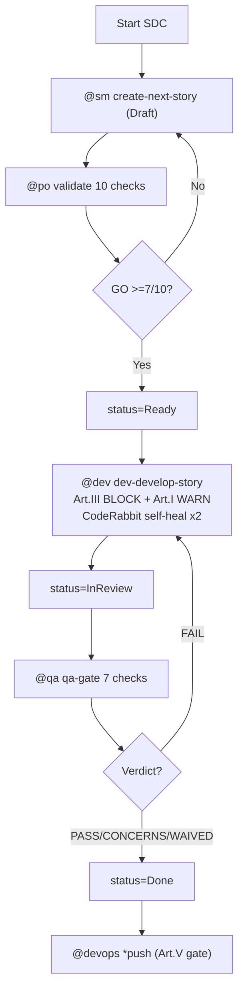
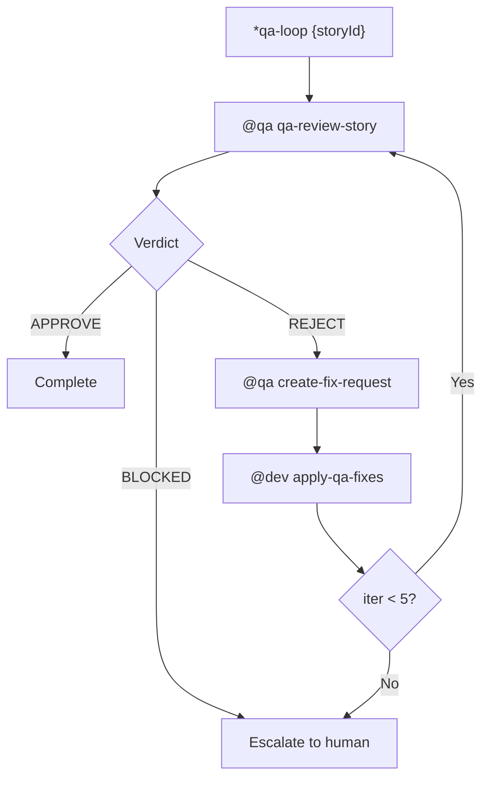
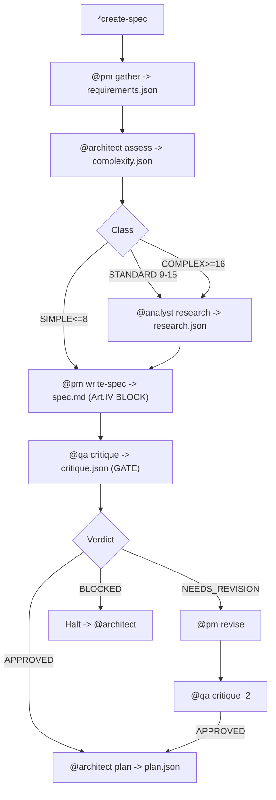
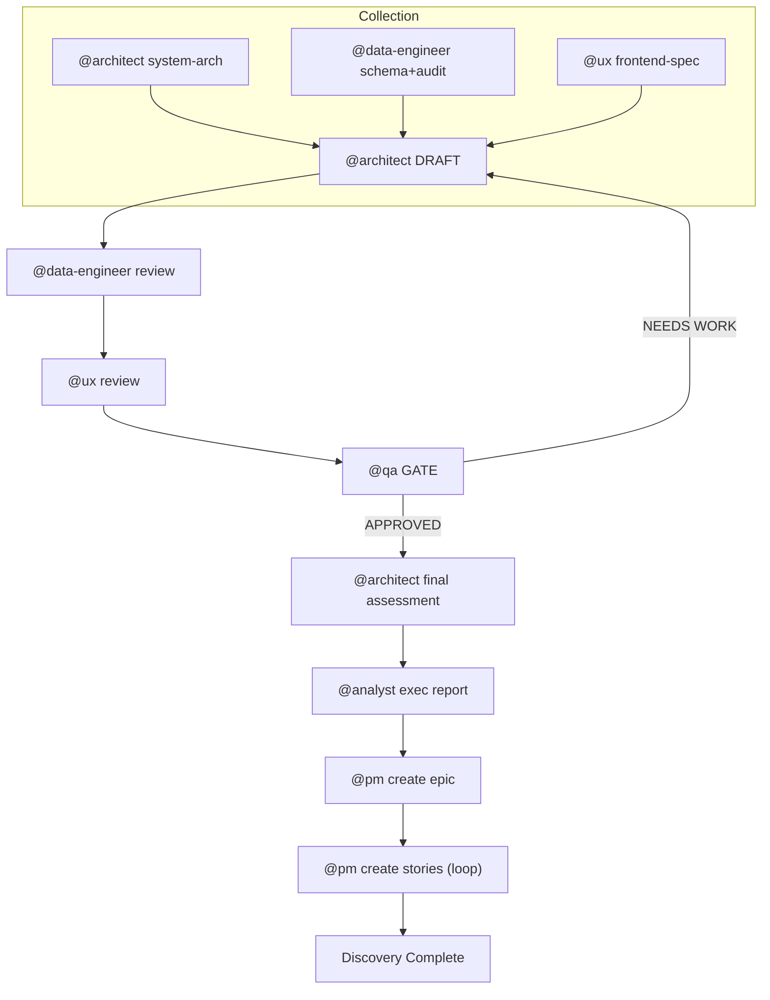
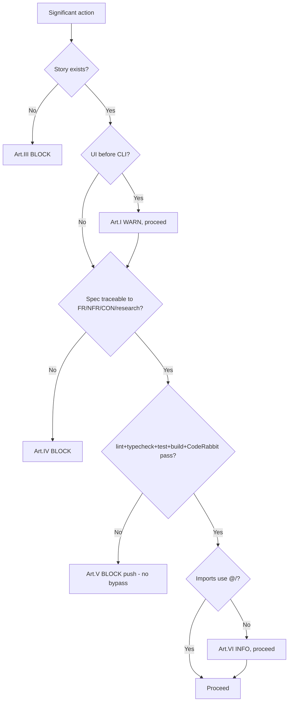

# AIOX Complete Mapping — Workflows, Tasks, Quality Gates & Constitution

> **Prepared by:** Atlas (AIOX Analyst) | **Date:** 2026-06-04
> **Purpose:** Complete extraction of AIOX workflows, task chains, quality gates, agent authority and Constitution enforcement, for integration into an external control system (Claude Code Monitor + Control Plane).
> **Precision policy:** 100% derived from real files. Every claim is sourced. Nothing invented. Where a file is silent, this document says so explicitly.

## Source Files (authoritative)

| Domain | File |
|--------|------|
| Constitution | `.aiox-core/constitution.md` |
| SDC workflow | `.aiox-core/development/workflows/story-development-cycle.yaml` |
| QA Loop workflow | `.aiox-core/development/workflows/qa-loop.yaml` |
| Spec Pipeline workflow | `.aiox-core/development/workflows/spec-pipeline.yaml` |
| Brownfield Discovery workflow | `.aiox-core/development/workflows/brownfield-discovery.yaml` |
| Complexity scoring | `.aiox-core/development/tasks/spec-assess-complexity.md` |
| No-Invention gate | `.aiox-core/development/tasks/spec-write-spec.md` |
| Story-Driven + CLI-First gates | `.aiox-core/development/tasks/dev-develop-story.md` |
| Quality-First gate | `.aiox-core/development/tasks/github-devops-pre-push-quality-gate.md` |
| Story lifecycle | `.claude/rules/story-lifecycle.md` |
| Agent authority | `.claude/rules/agent-authority.md` |
| CodeRabbit integration | `.claude/rules/coderabbit-integration.md` |
| IDS gates G1-G6 | `.claude/rules/ids-principles.md` |
| Project config | `.aiox-core/core-config.yaml` |

---

# 1. Four Primary Workflows

## 1.1 Story Development Cycle (SDC) — PRIMARY

**ID:** `story-development-cycle` | **Type:** generic | 4 phases.
**Execution modes** (from workflow `execution_modes`): `yolo` (0-1 prompts), `interactive` (5-10 prompts, **default**), `preflight` (10-15 prompts).

### Phases, tasks, status transitions

| Phase | Step id | Agent | Task | Story status after | on_failure |
|-------|---------|-------|------|--------------------|------------|
| 1. Create | `create` | @sm | `create-next-story.md` (or `brownfield-create-story.md`) | Draft | — |
| 2. Validate | `validate` | @po | `validate-next-story.md` (10-point) | Draft→**Ready** (on GO) | → `create` |
| 3. Implement | `implement` | @dev | `dev-develop-story.md` | Ready→InProgress→**InReview** | — |
| 4. QA Review | `review` | @qa | `qa-gate.md` | InReview→**Done** (PASS/CONCERNS/WAIVED) or →InProgress (FAIL) | → `implement` |

**Status machine** (`story-lifecycle.md`): `Draft → Ready → InProgress → InReview → Done`.
Ownership of transitions:
- `Draft→Ready`: **@po** during `*validate-story-draft` (GO verdict). Leaving Draft after GO = process violation.
- `Ready→InProgress` and `InProgress→InReview`: **@dev** (logged in Change Log).
- `InReview→Done` and `InReview→InProgress` (FAIL): **@qa**.
- **@devops does NOT change story status** — push authority starts only after story reflects QA outcome.

### ASCII flowchart

```
            ┌─────────────────────────────┐
            │  START: SDC                 │
            └──────────────┬──────────────┘
                           v
            ┌─────────────────────────────┐
   ┌───────>│ P1 @sm  create-next-story   │  status=Draft
   │        └──────────────┬──────────────┘
   │                       v
   │        ┌─────────────────────────────┐
   │        │ P2 @po  validate (10 checks)│
   │        └──────────────┬──────────────┘
   │                  <GO? (>=7/10)>
   │           NO ─────────┤
   └──────(feedback to @sm)│ YES  status=Ready
                           v
            ┌─────────────────────────────┐
   ┌───────>│ P3 @dev dev-develop-story   │  Ready->InProgress->InReview
   │        │   + CodeRabbit self-heal x2 │
   │        └──────────────┬──────────────┘
   │                       v
   │        ┌─────────────────────────────┐
   │        │ P4 @qa  qa-gate (7 checks)  │
   │        └──────────────┬──────────────┘
   │              <Quality gate?>
   │   FAIL ───────────────┤
   └──(feedback to @dev)    │ PASS/CONCERNS/WAIVED  status=Done
                           v
            ┌─────────────────────────────┐
            │  Story Done → @devops *push │  (after status reflects gate)
            └─────────────────────────────┘
```

---

## 1.2 QA Loop — ITERATIVE REVIEW

**ID:** `qa-loop` | **Type:** loop | Epic 6 — QA Evolution (ADE). **maxIterations: 5** (config path `autoClaude.qaLoop.maxIterations`). Status file: `qa/loop-status.json`.

### Steps (sequence)

| Step | Phase | Agent | Task | Output |
|------|-------|-------|------|--------|
| `review` | 1 | @qa | `qa-review-story.md` | `gate-file.yaml`, verdict, issuesFound |
| `check_verdict` | 2 | system | (condition check) | next action |
| `create_fix_request` | 3 | @qa | `qa-create-fix-request.md` | `fix-request.md`, prioritizedIssues |
| `fix_issues` | 4 | @dev | `dev-apply-qa-fixes.md` | `fixes-applied.json`, issuesFixed |
| `increment_iteration` | 5 | system | (increment + check max) | loop or escalate |

### Verdicts (step `check_verdict`)
- `APPROVE` → **complete** ("Story APPROVED after N iterations").
- `BLOCKED` → **escalate** ("requires human intervention").
- `REJECT` → **continue** → `create_fix_request`.

### Timeouts / retries (config)
- reviewTimeout 1,800,000 ms (30 min); fixTimeout 3,600,000 ms (60 min); maxRetries 2; retryDelay 5,000 ms.

### Escalation triggers
`max_iterations_reached`, `verdict_blocked`, `fix_failure`, `manual_escalate`.
On escalate: status=`escalated`, context_package = loop-status.json + all gate files + all fix requests + summary.

### Control commands
`*qa-loop`, `*qa-loop-review`, `*qa-loop-fix`, `*stop-qa-loop`, `*resume-qa-loop`, `*escalate-qa-loop`, `*qa-loop --reset`.

### ASCII flowchart

```
 *qa-loop {storyId}
        v
 ┌──────────────┐   retry x2 on fail ──> escalate
 │ 1 @qa review │
 └──────┬───────┘
        v
 ┌──────────────┐   APPROVE ─────────────> COMPLETE
 │ 2 verdict?   │   BLOCKED ─────────────> ESCALATE
 └──────┬───────┘   REJECT ↓
        v
 ┌──────────────┐
 │ 3 @qa fix-req│
 └──────┬───────┘
        v
 ┌──────────────┐   fail+retry exhausted > ESCALATE
 │ 4 @dev fix   │
 └──────┬───────┘
        v
 ┌──────────────┐  iter >= 5 ───────────> ESCALATE (max_iterations)
 │ 5 iter++ ?   │  iter <  5 ──┐
 └──────────────┘              └─> back to step 1
```

---

## 1.3 Spec Pipeline — PRE-IMPLEMENTATION

**ID:** `spec-pipeline` | **Type:** pipeline (ADE). `strictGate: true` (BLOCKED halts). Output dir: `docs/stories/{storyId}/spec/`.
**Note:** In `core-config.yaml`, `autoClaude.specPipeline.enabled: false` — pipeline runs only on explicit `*create-spec`.

### Six phases (sequence) — inputs/outputs

| Phase | Step | Agent | Task | Output | skip_if |
|-------|------|-------|------|--------|---------|
| 1. Gather | `gather` | @pm | `spec-gather-requirements.md` | `requirements.json` | never (elicit:true) |
| 2. Assess | `assess` | @architect | `spec-assess-complexity.md` | `complexity.json` | source=simple OR override=SIMPLE |
| 3. Research | `research` | @analyst | `spec-research-dependencies.md` (Context7, EXA) | `research.json` | complexity=SIMPLE |
| 4. Write | `spec` | @pm | `spec-write-spec.md` | `spec.md` | never |
| 5. Critique | `critique` | @qa | `spec-critique.md` | `critique.json` | never (**gate**) |
| 5b. Revise | `revise` | @pm | (inline) | `spec.md` updated | runs if COMPLEX or NEEDS_REVISION |
| 5c. Critique 2 | `critique_2` | @qa | `spec-critique.md` | `critique.json` updated | COMPLEX only (**gate**) |
| 6. Plan | `plan` | @architect | `plan-create-implementation.md` | `plan.json` | only if APPROVED |

### Complexity classification (`spec-assess-complexity.md`)

**5 dimensions, each scored 1-5** (total range 5-25):

| # | Dimension | What it measures |
|---|-----------|------------------|
| 1 | Scope | files/components affected (1=1-2 files … 5=20+ files / whole architecture) |
| 2 | Integration | external integrations (1=none … 5=multi-system orchestration) |
| 3 | Infrastructure | infra changes (1=none … 5=new infrastructure) |
| 4 | Knowledge | knowledge needed (1=existing patterns … 5=unknown domain) |
| 5 | Risk | negative-impact risk (1=isolated … 5=critical, system core) |

**Thresholds (exact, from file):**

| Class | Total score | Phases activated |
|-------|-------------|------------------|
| SIMPLE | `max_total: 8` (≤8) | gather → spec → critique |
| STANDARD | 9-15 (`min 9, max 15`) | gather → assess → research → spec → critique → plan |
| COMPLEX | `min_total: 16` (≥16) | gather → assess → research → spec → critique_1 → revise → critique_2 → plan |

### Critique verdicts (gate)
- `APPROVED` → next: `plan`.
- `NEEDS_REVISION` → `return_to_spec`, pass [critique.json, autoFixes], `max_iterations: 2`.
- `BLOCKED` → halt, `escalate_to: @architect`.
- (critique_2 NEEDS_REVISION → halt: "manual intervention needed".)

> **Note on verdict scoring:** the SDC/story-lifecycle docs reference critique averages (APPROVED ≥4.0, NEEDS_REVISION 3.0-3.9, BLOCKED <3.0) as guidance; the workflow YAML itself encodes verdicts by name, not by numeric threshold. The numeric averages are documented in `workflow-execution.md`, not in `spec-pipeline.yaml`.

### Resume checkpoints
State file `docs/stories/{storyId}/spec/.pipeline-state.json`. resume_from: requirements_gathered→assess, complexity_assessed→research, research_complete→spec, spec_written→critique, critique_complete→plan.

### ASCII flowchart

```
 *create-spec {storyId}
        v
 [1 @pm gather] -> requirements.json
        v
 [2 @architect assess] -> complexity.json  (skip if SIMPLE source)
        | score<=8 SIMPLE | 9-15 STANDARD | >=16 COMPLEX
        v
 [3 @analyst research] -> research.json     (skip if SIMPLE)
        v
 [4 @pm write spec] -> spec.md   (No-Invention BLOCK gate)
        v
 [5 @qa critique] -> critique.json  === GATE ===
        |  APPROVED ────────────────────────────> [6 plan]
        |  NEEDS_REVISION (max 2) -> [5b @pm revise] -> [5c @qa critique_2] -> APPROVED -> [6 plan]
        |  BLOCKED ──────────────> HALT, escalate @architect
        v
 [6 @architect plan] -> plan.json -> COMPLETE
```

---

## 1.4 Brownfield Discovery — LEGACY ASSESSMENT

**ID:** `brownfield-discovery` v2.0 | 10 phases. Total estimate: 4-8 h.

### Phases — data collection → validation → finalization

| Phase | Step | Agent | Action / Command | Creates | Condition |
|-------|------|-------|------------------|---------|-----------|
| 1 | system_documentation | @architect | `*document-project` | `docs/architecture/system-architecture.md` | — |
| 2 | database_documentation | @data-engineer | `*db-schema-audit` + `*security-audit` | `supabase/docs/SCHEMA.md`, `DB-AUDIT.md` | project_has_database |
| 3 | frontend_documentation | @ux-design-expert | `*create-front-end-spec` | `docs/frontend/frontend-spec.md` | — |
| 4 | initial_consolidation | @architect | manual prompt | `docs/prd/technical-debt-DRAFT.md` | requires P1-P3 |
| 5 | database_specialist_review | @data-engineer | manual review | `docs/reviews/db-specialist-review.md` | requires DRAFT |
| 6 | ux_specialist_review | @ux-design-expert | manual review | `docs/reviews/ux-specialist-review.md` | requires DRAFT |
| 7 | qa_general_review | @qa | manual review (**QA GATE**) | `docs/reviews/qa-review.md` | requires P4-P6 |
| 8 | final_assessment | @architect | manual consolidation | `docs/prd/technical-debt-assessment.md` | condition: qa_review_approved |
| 9 | executive_awareness_report | @analyst | manual report | `docs/reports/TECHNICAL-DEBT-REPORT.md` | requires P8 |
| 10 | epic_creation | @pm | `brownfield-create-epic.md` | `docs/stories/epic-technical-debt.md` | requires P8+P9 |
| 10 | story_creation | @pm | `brownfield-create-story.md` (repeats per debt) | `docs/stories/story-X.X-*.md` | requires epic |

**QA Gate (Phase 7):** verdict `APPROVED` → proceed to Phase 8; `NEEDS WORK` → rework: apply fixes to DRAFT → re-consolidate (back to Phase 4).

### ASCII flowchart

```
 COLLECTION (P1-P3)         CONSOLIDATION (P4)
 [1 @architect sys] ─┐
 [2 @data-eng db]  ──┼──> [4 @architect DRAFT]
 [3 @ux frontend]  ─┘            │
                                 v
 VALIDATION (P5-P7)     [5 @data-eng review]
                                 v
                        [6 @ux review]
                                 v
                        [7 @qa GATE] ──NEEDS WORK──> back to [4]
                                 │ APPROVED
 FINALIZATION (P8-P9)            v
                        [8 @architect final assessment]
                                 v
                        [9 @analyst exec report]
 PLANNING (P10)                  v
                        [10 @pm epic] -> [10 @pm stories] -> DONE
```

---

# 2. Task Chains (per workflow)

Format: task → inputs → outputs → pre/post conditions → gate after.

## 2.1 SDC chain

| Task | Inputs | Outputs | Pre-condition | Post / Gate after |
|------|--------|---------|---------------|-------------------|
| `create-next-story.md` | PRD sharded, epic context | `{epic}.{story}.story.md`, story_id (status Draft) | PRD/epic available | validation_report (→ @po) |
| `validate-next-story.md` | story_file | validation_report, story_status | story exists | **GO ≥7/10 → Ready**; NO-GO → back to @sm |
| `dev-develop-story.md` | validated story (Ready) | implementation_files, test_results, commit_hash (InReview) | **Gate: Article III story exists (BLOCK); Article I CLI First (WARN)** | CodeRabbit self-heal (≤2); then → @qa |
| `qa-gate.md` | implementation, story AC | qa_report, quality_gate_status, final_status | story InReview | **PASS/CONCERNS/WAIVED→Done**; FAIL→InProgress |



**Dependency:** strictly linear with two back-edges (validate→create on NO-GO; review→implement on FAIL).

## 2.2 QA Loop chain

| Task | Inputs | Outputs | Pre | Post / Gate |
|------|--------|---------|-----|-------------|
| `qa-review-story.md` | storyId, iteration, previousIssues | `gate-file.yaml`, verdict, issuesFound | story implemented | verdict gate (APPROVE/BLOCKED/REJECT) |
| `qa-create-fix-request.md` | storyId, gateFile, iteration | `fix-request.md`, prioritizedIssues | verdict=REJECT | fallback: raw gate file |
| `dev-apply-qa-fixes.md` | storyId, fixRequest, iteration | `fixes-applied.json`, issuesFixed | fix-request exists | retry x2; exhausted→escalate |



**Dependency:** cyclic (steps 1-5 loop), bounded by maxIterations=5.

## 2.3 Spec Pipeline chain

| Task | Inputs | Outputs | Gate after |
|------|--------|---------|-----------|
| `spec-gather-requirements.md` | storyId, source, prdPath | `requirements.json` | none (halt on fail) |
| `spec-assess-complexity.md` | requirements.json, overrideComplexity | `complexity.json` | none (advisory; fallback STANDARD) |
| `spec-research-dependencies.md` | requirements.json, complexity.json | `research.json` | none (fallback minimal) |
| `spec-write-spec.md` | requirements + complexity + research | `spec.md` | **Article IV No-Invention (BLOCK)** |
| `spec-critique.md` | spec + requirements + complexity + research | `critique.json` | **Blocking gate (APPROVED/NEEDS_REVISION/BLOCKED)** |
| `plan-create-implementation.md` | spec.md, complexity.json | `plan.json` | only if APPROVED |

```mermaid
graph TD
    subgraph Spec_Pipeline_Tasks["Spec Pipeline Task Chain Flows"]
        gather["spec-gather-requirements.md<br>(@pm)"] -->|requirements.json| assess["spec-assess-complexity.md<br>(@architect)"]
        assess -->|complexity.json| research["spec-research-dependencies.md<br>(@analyst)"]
        research -->|research.json| write_spec["spec-write-spec.md<br>(@pm)"]
        write_spec -->|spec.md| critique["spec-critique.md<br>(@qa)"]
        critique -->|verdict| v_critique{"Verdict?"}
        v_critique -->|APPROVED| plan["plan-create-implementation.md<br>(@architect)"]
        v_critique -->|NEEDS_REVISION (max 2)| revise["pm revise inline"] --> critique
        v_critique -->|BLOCKED| halt["Halt & Escalate to @architect"]
    end
```

## 2.4 Brownfield chain

Linear with one back-edge (P7 NEEDS WORK → P4). P10 story_creation `repeats: for_each_prioritized_debt`. Full requires/creates table in §1.4.



---

# 3. Quality Gates

## 3.1 Story Lifecycle gates

**PO 10-Point Validation** (`validate-next-story.md`): (1) clear title, (2) complete description, (3) testable AC (Given/When/Then), (4) scope IN/OUT, (5) dependencies mapped, (6) complexity estimate, (7) business value, (8) risks documented, (9) criteria of Done, (10) PRD/Epic alignment. **Decision: GO ≥7/10 → Ready; NO-GO <7 → fixes.**

**QA Gate 7 checks** (`qa-gate.md`): (1) code review, (2) unit tests, (3) AC met, (4) no regressions, (5) performance, (6) security (OWASP basics), (7) documentation. **Verdicts:** PASS / CONCERNS / FAIL / WAIVED.

Gate file schema (`story-lifecycle.md`):
```yaml
storyId: STORY-42
verdict: PASS | CONCERNS | FAIL | WAIVED
issues:
  - severity: low | medium | high
    category: code | tests | requirements | performance | security | docs
    description: "..."
    recommendation: "..."
```

**Story file edit authority:** Title/Description/AC/Scope = @po only; File List/Dev Notes/checkboxes = @dev; QA Results = @qa only; Change Log = any agent (append only).

## 3.2 CodeRabbit integration points

| Workflow | Phase | Trigger | Agent | Mode | Max iters |
|----------|-------|---------|-------|------|-----------|
| SDC | 3 Implement | after task completion | @dev | light | 2 |
| QA Loop | 1 Review | at review start | @qa | full | 3 |
| Pre-push | DevOps gate | before push | @devops | (CLI `-t uncommitted`) | n/a |
| Standalone | any | `*coderabbit-review` | any | — | — |

**Severity handling** (`coderabbit-integration.md` + `core-config.yaml`):

| Severity | Dev phase | QA phase | Pre-push gate |
|----------|-----------|----------|---------------|
| CRITICAL | auto_fix, block if persists | auto_fix, block if persists | **FAIL → block push** |
| HIGH | auto_fix (iter<2) else document | auto_fix | **CONCERNS → warn, ask confirm** |
| MEDIUM | document_as_tech_debt | document_as_tech_debt | PASS with notes |
| LOW | ignore | ignore | PASS |

Dev self-heal loop: `while CRITICAL and iter<2: auto-fix; if persist after 2 → HALT manual`. Reports: `docs/qa/coderabbit-reports/`. Windows: runs via WSL `~/.local/bin/coderabbit`. Graceful degradation: skip if not installed.

## 3.3 Constitution enforcement points (gates in real tasks)

| Article | Severity | Enforced in (real file) | Gate behavior |
|---------|----------|-------------------------|---------------|
| I CLI First | WARN | `dev-develop-story.md` Gate 2 | WARN if UI before functional CLI |
| III Story-Driven | BLOCK | `dev-develop-story.md` Gate 1 | BLOCK if no valid story |
| IV No Invention | BLOCK | `spec-write-spec.md` | BLOCK if spec content not traceable to FR-*/NFR-*/CON-*/research |
| V Quality First | BLOCK | `github-devops-pre-push-quality-gate.md` | BLOCK if lint/typecheck/test/build/CodeRabbit-CRITICAL/story-status fail; **bypass not allowed** |
| II Agent Authority | (enforced by agent defs + `.claude/settings.json` deny rules) | — | structural, no separate task gate |
| VI Absolute Imports | INFO/SHOULD | ESLint rule (`@/` alias) | reported, not blocking |

---

# 4. Agent Authority Matrix

## 4.1 Who does what

| Agent | Persona | Owns |
|-------|---------|------|
| @dev | Dex | Implementation; local git (add/commit/branch/checkout/merge/stash/diff/log); story File List/Dev Notes/checkboxes |
| @qa | Quinn | Quality verdicts; QA Results section; qa-gate; QA loop review |
| @architect | Aria | Architecture decisions, tech selection, complexity assessment, integration patterns |
| @pm | Morgan | Epic orchestration (`*create-epic`, `*execute-epic`), requirements gathering, spec writing |
| @po | Pax | Story validation (`*validate-story-draft`, 10-point), backlog prioritization, story context in epics; Title/Description/AC/Scope edits |
| @sm | River | Story creation (`*draft`/`*create-story`), template selection |
| @analyst | Atlas/Alex | Research, market/competitor analysis, brownfield exec report |
| @data-engineer | Dara | Schema DDL, query optimization, RLS policies, indexes, migrations (delegated from @architect) |
| @ux-design-expert | Uma | UX/UI, frontend spec |
| @devops | Gage | **EXCLUSIVE**: git push, PR, release/tag, MCP management, CI/CD |
| @aiox-master | Orion | Framework governance, orchestration, constitutional enforcement |

> Note: CLAUDE.md lists @analyst persona as "Alex"; the analyst skill/command file names the persona **Atlas**. Both refer to the same agent; the canonical skill says Atlas.

## 4.2 @devops EXCLUSIVE operations (BLOCKED for all others)

`git push` / `git push --force`; `gh pr create` / `gh pr merge`; MCP add/remove/configure; CI/CD pipeline management; release management.

## 4.3 Delegation flows (from `agent-authority.md`)

```
Git push:     ANY agent ───────────────> @devops *push
Schema:       @architect (tech choice) ─> @data-engineer (DDL)
Story:        @sm *draft -> @po *validate -> @dev *develop -> @qa *qa-gate -> @devops *push
Epic:         @pm *create-epic -> @pm *execute-epic -> @sm *draft (per story)
```

## 4.4 Escalation rules

1. Agent cannot complete → escalate to @aiox-master. 2. Quality gate fails → return to @dev with feedback. 3. Constitutional violation → BLOCK, fix before proceed. 4. Agent boundary conflict → @aiox-master mediates.

---

# 5. Constitution Enforcement (per Article)

Source: `.aiox-core/constitution.md` v1.0.0 (ratified 2025-01-30). Gate severity levels: **BLOCK** (prevents execution, NON-NEGOTIABLE/critical MUST) · **WARN** (proceed with alert, non-critical MUST) · **INFO** (report only, SHOULD).

### Art. I — CLI First (NON-NEGOTIABLE)
Hierarchy: CLI > Observability > UI. Dashboards observe, never control. **Enforced:** `dev-develop-story.md` Gate 2, severity **WARN** ("UI before functional CLI"). Constitution itself names the gate as `dev-develop-story.md`.

### Art. II — Agent Authority (NON-NEGOTIABLE)
Only @devops: push, PR, release/tag. Agents must delegate out-of-scope work. **Enforced:** via agent definitions + `.claude/settings.json` deny rules (`boundary.frameworkProtection` toggle, default false in this project per `core-config.yaml`). Constitution states: "Implementado via definição de agentes (não requer gate adicional)."

### Art. III — Story-Driven Development (MUST)
No code without an associated story; AC before implementation; progress via checkboxes; File List maintained. **Enforced:** `dev-develop-story.md` Gate 1, severity **BLOCK** ("no valid story").

### Art. IV — No Invention (MUST)
Every spec statement must trace to FR-*/NFR-*/CON-*/research finding. No invented features, no unresearched implementation details, no unvalidated technologies. **Enforced:** `spec-write-spec.md` constitutional_gate, severity **BLOCK**, plus a traceability check in `spec-critique.md`.

### Art. V — Quality First (MUST)
Required passing: `npm run lint`, `npm run typecheck`, `npm test`, `npm run build`, CodeRabbit no CRITICAL, story status Done/Ready-for-Review. **Enforced:** `github-devops-pre-push-quality-gate.md`, severity **BLOCK**, `bypass.allowed: false`. Also runs security scan (npm audit + ESLint security + secretlint) and advisory impact analysis (never blocks).

### Art. VI — Absolute Imports (SHOULD)
Use `@/` alias; avoid `../../../`; same-module relative allowed. **Enforced:** ESLint rule, severity **INFO** (reported, non-blocking).

### Governance
Amendment: documented proposal → review by @architect + @po → consensus → version bump → propagate to templates/tasks. Versioning: MAJOR/MINOR/PATCH. Every PR must verify Constitution compliance.

---

# 6. Diagrams (Mermaid)

## 6.1 SDC



## 6.2 QA Loop



## 6.3 Spec Pipeline



## 6.4 Brownfield Discovery



## 6.5 Constitution gate decision tree



---

# 7. Notes for the Control Plane / Monitor integration

- **State sources to poll:** story status field in `docs/stories/*.story.md`; `qa/loop-status.json` (QA loop); `docs/stories/{id}/spec/.pipeline-state.json` (spec pipeline); `.aiox/dashboard/status.json` and `.aiox/status.json` (legacy) per qa-loop integration; `.aiox/project-status.yaml` (project status, autoLoad on agent activation).
- **Hard blocking gates a monitor must respect (cannot auto-override):** Art.III (dev), Art.IV (spec), Art.V (pre-push, bypass disabled), CodeRabbit CRITICAL, secretlint secret detection.
- **Advisory-only signals (never block):** Art.I WARN, Art.VI INFO, pre-push impact analysis, complexity assessment (advisory, fallback STANDARD).
- **Exclusive operation to route to @devops only:** push, PR, release, MCP config — a control plane must not trigger these under any other agent.
- **Config flags that change behavior:** `autoClaude.specPipeline.enabled=false`, `autoClaude.execution.enabled=false`, `autoClaude.qa.enabled=false`, `boundary.frameworkProtection=false` (this project). These mean spec pipeline / autonomous execution / autonomous QA are currently OFF and run only on explicit command.

---

*End of mapping. All content derived from the source files listed at the top. Verdict numeric thresholds for spec critique are documented in `workflow-execution.md` but are NOT encoded numerically in `spec-pipeline.yaml`; flagged in §1.3.*
